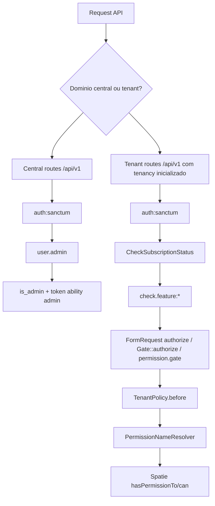
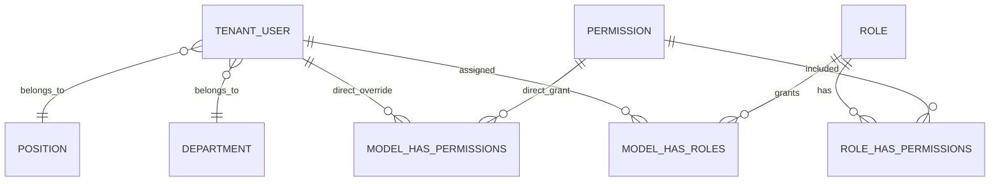
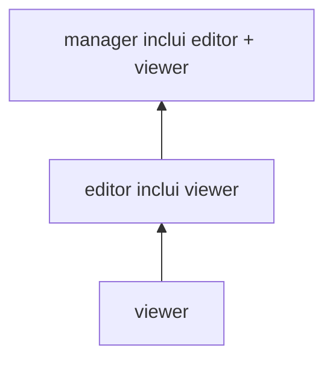
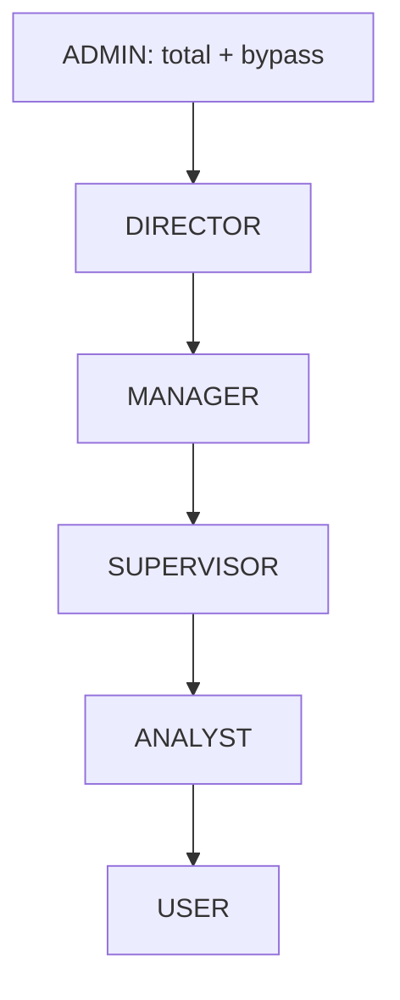
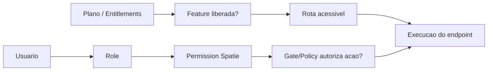
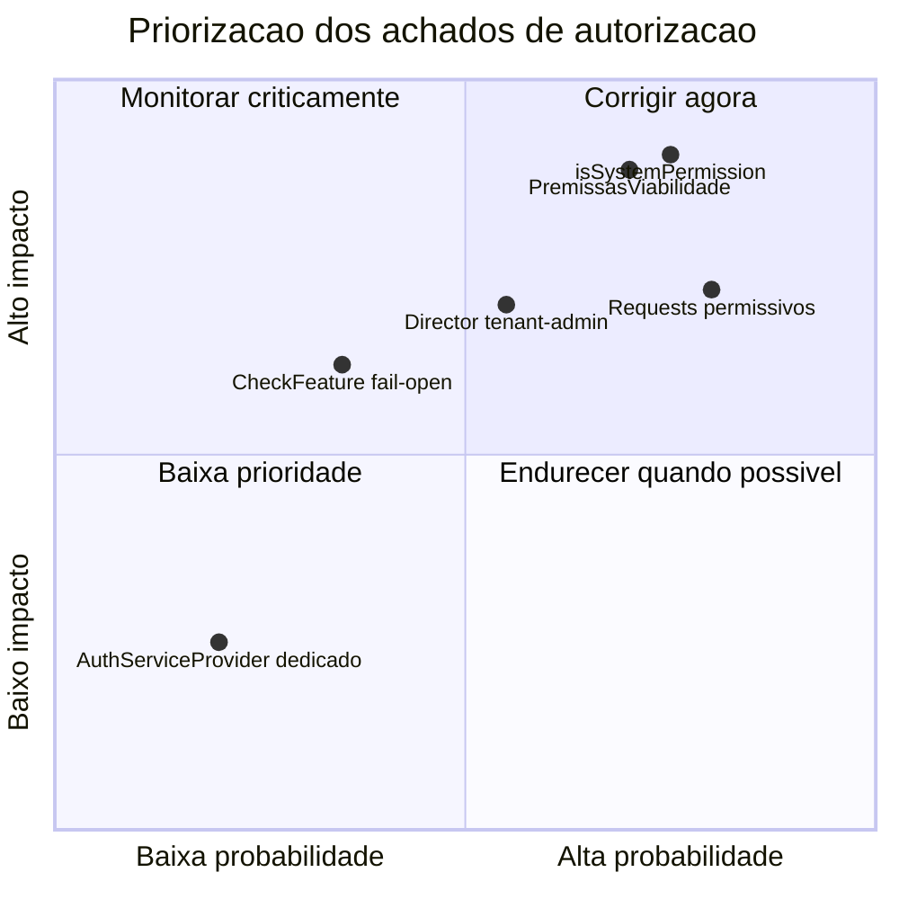

# Analise De Permissoes Do Backend

**Data:** 2026-05-11  
**Projeto:** Backend Laravel 12+ SIG.APP  
**Escopo:** Auditoria estatica do sistema de permissoes, roles, entitlements, planos, departamentos, cargos, policies, middlewares e rotas.
**Plano de correcao:** [`2026-05-12-plano-correcao-sistema-permissoes.md`](./2026-05-12-plano-correcao-sistema-permissoes.md)

> Esta analise foi baseada em codigo, migrations, seeders, templates JSON e rotas do backend em `/Users/edsongmaldonado/Herd/sigapp/backend`. Nao foi consultado um banco live; portanto, o documento representa a configuracao canonica versionada no repositorio. Dados alterados manualmente em producao podem divergir.

## Sumario Executivo

O backend possui uma base solida de RBAC multi-tenant com Spatie, permissoes em dot notation, roles canonicas e entitlements por plano, mas a aplicacao pratica ainda esta fragmentada entre middlewares, FormRequests, controllers e ferramentas de IA. A revisao cruzada posterior elevou dois riscos: `PermissionRepository::isSystemPermission()` tem bug real para permissoes com submodulos, permitindo que permissoes canonicas como `prospection.terrains.viewer` nao sejam reconhecidas como sistema, e `PremissasViabilidade` esta fora do `ModulesEnum::modelMap()` e das policies registradas, tornando o recurso invisivel para o desenho RBAC atual. Alem disso, ha over-permissioning entre `DIRECTOR`/`MANAGER`/`SUPERVISOR`, endpoints mutaveis com `authorize(): true`, uso inconsistente de `permission.gate` e ausencia de ABAC real para departamentos/cargos. A recomendacao central e padronizar a autorizacao em uma matriz auditavel rota -> feature -> policy/permission, corrigir permissoes de sistema protegidas, integrar `PremissasViabilidade` ao RBAC e tornar a distincao entre plano, role e departamento explicita e testada.

---

## 1. Inventario Completo De Permissoes

### 1.1 Modelo Geral

O backend tem quatro familias de controle de acesso:

| Familia | Implementacao | Tipo | Granularidade | Fonte |
|---|---|---|---|---|
| RBAC tenant | Spatie `roles`, `permissions`, `model_has_roles`, `role_has_permissions`, `model_has_permissions` | RBAC com permissoes diretas opcionais | Por tenant/schema, modulo, recurso e nivel | `config/permission.php`, `database/migrations/tenant/0001_01_01_000004_create_permission_tables.php` |
| Policies tenant | `TenantPolicy` + `PermissionNameResolver` | RBAC aplicado via Laravel Gate/Policy | Por model/action, convertido para `{module}.{level}` ou `{module}.{resource}.{level}` | `app/Policies/Tenant/TenantPolicy.php` |
| Feature flags/planos | `entitlements`, `plan_entitlements`, `tenant_entitlements` | Feature Flag + Limits/Quota | Por tenant/plano, com overrides por tenant | `database/seeders/EntitlementSeeder.php` |
| Admin central | `users.is_admin` + Sanctum ability `admin` | RBAC binario + token ability | Global central | `app/Http/Middleware/EnsureUserIsAdmin.php` |

### 1.2 Permissoes RBAC Tenant

Niveis definidos em `app/Enums/AccessLevel.php`:

| Nivel | Valor tecnico | Intencao |
|---|---|---|
| Viewer | `viewer` | Leitura/visualizacao |
| Editor | `editor` | Criacao e atualizacao |
| Manager | `manager` | Acoes sensiveis, destrutivas ou gerenciais |

Mapeamento HTTP em `app/Services/Acl/PermissionNameResolver.php` e `app/Http/Middleware/PermissionGate.php`:

| Metodo HTTP | Nivel exigido |
|---|---|
| `GET` | `viewer` |
| `POST` | `editor` |
| `PUT` | `editor` |
| `PATCH` | `editor` |
| `DELETE` | `manager` |

O catalogo RBAC e gerado a partir de `App\Enums\Common\ModulesEnum` e `Database\Seeders\Tenant\RolePermissionSeeder`. Como existem 13 modulos, sendo `prospection` dividido em dois submodulos (`terrains` e `maps`), e 3 niveis (`viewer`, `editor`, `manager`), o seeder gera 42 permissoes canonicas.

| Permissao | Descricao clara | Tipo | Granularidade |
|---|---|---|---|
| `admin.viewer` | Visualizar modulo administrativo tenant | RBAC | Tenant/modulo/nivel |
| `admin.editor` | Criar/alterar no modulo administrativo tenant | RBAC | Tenant/modulo/nivel |
| `admin.manager` | Acoes gerenciais/destrutivas no modulo administrativo tenant | RBAC | Tenant/modulo/nivel |
| `configurations.viewer` | Visualizar configuracoes | RBAC | Tenant/modulo/nivel |
| `configurations.editor` | Criar/alterar configuracoes | RBAC | Tenant/modulo/nivel |
| `configurations.manager` | Gerenciar/remover configuracoes | RBAC | Tenant/modulo/nivel |
| `prospection.terrains.viewer` | Visualizar terrenos | RBAC | Tenant/modulo/recurso/nivel |
| `prospection.terrains.editor` | Criar/alterar terrenos | RBAC | Tenant/modulo/recurso/nivel |
| `prospection.terrains.manager` | Remover/gerenciar terrenos | RBAC | Tenant/modulo/recurso/nivel |
| `prospection.maps.viewer` | Visualizar mapas de prospeccao | RBAC | Tenant/modulo/recurso/nivel |
| `prospection.maps.editor` | Criar/alterar mapas de prospeccao | RBAC | Tenant/modulo/recurso/nivel |
| `prospection.maps.manager` | Gerenciar/remover mapas de prospeccao | RBAC | Tenant/modulo/recurso/nivel |
| `brokers.viewer` | Visualizar corretores externos | RBAC | Tenant/modulo/nivel |
| `brokers.editor` | Criar/alterar corretores externos | RBAC | Tenant/modulo/nivel |
| `brokers.manager` | Remover/gerenciar corretores externos | RBAC | Tenant/modulo/nivel |
| `data.viewer` | Visualizar dados auxiliares como regionais, produtos, proprietarios, documentos e associacoes | RBAC | Tenant/modulo/nivel |
| `data.editor` | Criar/alterar dados auxiliares | RBAC | Tenant/modulo/nivel |
| `data.manager` | Remover/gerenciar dados auxiliares | RBAC | Tenant/modulo/nivel |
| `dashboard.viewer` | Visualizar dashboards | RBAC | Tenant/modulo/nivel |
| `dashboard.editor` | Alterar recursos do dashboard, se houver endpoints mutaveis | RBAC | Tenant/modulo/nivel |
| `dashboard.manager` | Gerenciar recursos do dashboard | RBAC | Tenant/modulo/nivel |
| `committee.viewer` | Visualizar comite de revisao | RBAC | Tenant/modulo/nivel |
| `committee.editor` | Criar/alterar pareceres/revisoes de comite | RBAC | Tenant/modulo/nivel |
| `committee.manager` | Gerenciar/remover/finalizar acoes sensiveis do comite | RBAC | Tenant/modulo/nivel |
| `legal.viewer` | Visualizar legalizacoes e etapas | RBAC | Tenant/modulo/nivel |
| `legal.editor` | Criar/alterar legalizacoes, etapas, Gantt e progresso | RBAC | Tenant/modulo/nivel |
| `legal.manager` | Remover/gerenciar legalizacoes | RBAC | Tenant/modulo/nivel |
| `negotiation.viewer` | Visualizar negociacoes e contratos | RBAC | Tenant/modulo/nivel |
| `negotiation.editor` | Criar/alterar negociacoes, eventos e contratos | RBAC | Tenant/modulo/nivel |
| `negotiation.manager` | Gerenciar/remover acoes criticas de negociacao/contratos | RBAC | Tenant/modulo/nivel |
| `projects.viewer` | Visualizar sala de projetos | RBAC | Tenant/modulo/nivel |
| `projects.editor` | Criar/alterar projetos | RBAC | Tenant/modulo/nivel |
| `projects.manager` | Gerenciar/cancelar acoes criticas de projetos | RBAC | Tenant/modulo/nivel |
| `reports.viewer` | Visualizar relatorios | RBAC | Tenant/modulo/nivel |
| `reports.editor` | Criar/alterar relatorios, se houver endpoints mutaveis | RBAC | Tenant/modulo/nivel |
| `reports.manager` | Gerenciar relatorios | RBAC | Tenant/modulo/nivel |
| `viability.viewer` | Visualizar viabilidades | RBAC | Tenant/modulo/nivel |
| `viability.editor` | Criar/alterar/ativar/recalcular/duplicar/solicitar aprovacao de viabilidades | RBAC | Tenant/modulo/nivel |
| `viability.manager` | Aprovar, excluir, restaurar, exportar e outras acoes criticas de viabilidade | RBAC | Tenant/modulo/nivel |
| `ai.viewer` | Visualizar recursos de IA | RBAC | Tenant/modulo/nivel |
| `ai.editor` | Executar/criar automacoes e tarefas de IA | RBAC | Tenant/modulo/nivel |
| `ai.manager` | Gerenciar recursos de IA | RBAC | Tenant/modulo/nivel |

### 1.3 Feature Flags E Limites Por Plano

Entitlements canonicos definidos em `database/seeders/EntitlementSeeder.php`.

| Entitlement | Tipo | Descricao | Granularidade |
|---|---|---|---|
| `home` | Feature Flag | Home | Tenant/plano |
| `prospection` | Feature Flag | Prospeccao | Tenant/plano |
| `committee` | Feature Flag | Comite de revisao | Tenant/plano |
| `negotiation` | Feature Flag | Negociacoes | Tenant/plano |
| `legalizations` | Feature Flag | Legalizacoes | Tenant/plano |
| `projects_room` | Feature Flag | Sala de projetos | Tenant/plano |
| `product_settings` | Feature Flag | Configuracao de produtos | Tenant/plano |
| `regionals` | Feature Flag | Regionais | Tenant/plano |
| `territorial_base` | Feature Flag | Base territorial/cidades | Tenant/plano |
| `ai` | Feature Flag | Assistente de IA | Tenant/plano |
| `dashboard.enabled` | Feature Flag | Dashboard | Tenant/plano |
| `dashboard.overview` | Feature Flag | Visao geral dashboard | Tenant/plano |
| `dashboard.units_closed` | Feature Flag | Unidades fechadas | Tenant/plano |
| `dashboard.vgv` | Feature Flag | VGV dashboard | Tenant/plano |
| `dashboard.funnel` | Feature Flag | Funil dashboard | Tenant/plano |
| `viabilities.enabled` | Feature Flag | Viabilidades | Tenant/plano |
| `viabilities.summary` | Feature Flag | Resumo de viabilidades | Tenant/plano |
| `viabilities.dre` | Feature Flag | DRE | Tenant/plano |
| `viabilities.cash_flow` | Feature Flag | Fluxo de caixa | Tenant/plano |
| `viabilities.charts` | Feature Flag | Graficos | Tenant/plano |
| `viabilities.premises` | Feature Flag | Premissas | Tenant/plano |
| `viabilities.kpis` | Feature Flag | KPIs | Tenant/plano |
| `exports.excel` | Feature Flag | Exportacao Excel | Tenant/plano |
| `exports.pdf` | Feature Flag | Exportacao PDF | Tenant/plano |
| `users` | Limit/Quota | Limite de usuarios | Tenant/plano |
| `terrenos` | Limit/Quota | Limite de terrenos | Tenant/plano |
| `products` | Limit/Quota | Limite de produtos | Tenant/plano |
| `storage_gb` | Limit/Quota | Limite de armazenamento | Tenant/plano |
| `ai_budget` | Limit/Quota | Orcamento mensal IA em USD | Tenant/plano |

---

## 2. Onde E Como As Permissoes Sao Aplicadas

### 2.1 Fluxo De Autorizacao



### 2.2 Middlewares E Guards

| Controle | Arquivo | Aplicacao |
|---|---|---|
| `auth:sanctum` | `routes/api.php`, `routes/tenant.php` | Autenticacao API, tokens Sanctum |
| `user.admin` | `app/Http/Middleware/EnsureUserIsAdmin.php` | Exige `App\Models\User`, `is_admin=true` e token com ability `admin` |
| `tenant.admin` | `app/Http/Middleware/EnsureTenantAdmin.php` | Exige role `ADMIN`, `DIRECTOR`, `admin` ou `director` |
| `permission.gate` | `app/Http/Middleware/PermissionGate.php` | Resolve permissao pelo metodo HTTP e modulo/recurso |
| `check.feature` | `app/Http/Middleware/CheckFeature.php` | Bloqueia endpoint se plano/extra entitlement nao libera feature |
| `enforce.limits` | `app/Http/Middleware/EnforcePlanLimits.php` | Bloqueia criacao quando limite do plano e excedido |
| `ai.budget` | `app/Http/Middleware/AiBudgetCheck.php` | Bloqueia IA quando budget mensal estoura |
| `subscription.active` / `CheckSubscriptionStatus` | `app/Http/Middleware/CheckSubscriptionStatus.php` | Bloqueia tenant inativo/trial encerrado |

### 2.3 Policies / Services

| Ponto | Como funciona |
|---|---|
| `TenantPolicy::before()` | Resolve a permissao da model/action antes dos metodos da policy; se resolver, retorna `userCan()` |
| `PermissionNameResolver::forModel()` | Model tenant vira modulo: `Terreno` -> `prospection.terrains`, `Viabilidade` -> `viability`, etc. |
| `PermissionNameResolver::abilityLevel()` | `view/viewAny/compare` -> `viewer`; `create/update/ativar/requestApproval/duplicate/gerarDre/recalcular/reorder/syncGantt/recalcularProgresso` -> `editor`; demais acoes -> `manager` |
| `PermissionNameResolver::userCan()` | `ADMIN` bypassa; demais usam `user->can($permission)` |
| `TenantAclSyncService` / `RolePermissionSeeder` | Criam permissoes e roles, aplicam templates JSON cumulativos |
| `PlanMatrixService` | Resolve matriz efetiva de plano, mesclando entitlements base e extras de tenant |
| `TenantUserService` | Atribui roles e permissoes diretas por usuario |

### 2.4 Banco De Dados

| Tabela | Contexto | Funcao |
|---|---|---|
| `permissions` | Central e tenant, mas uso efetivo tenant | Catalogo de permissoes Spatie |
| `roles` | Central e tenant, mas uso efetivo tenant | Catalogo de roles Spatie |
| `role_has_permissions` | Tenant | Relacao Role -> Permission |
| `model_has_roles` | Tenant | Relacao User -> Role |
| `model_has_permissions` | Tenant | Permissoes diretas por usuario |
| `plans` | Central | Planos comerciais |
| `entitlements` | Central | Catalogo de features/limites |
| `plan_entitlements` | Central | Matriz base Plan -> Entitlement |
| `tenant_entitlements` | Central | Overrides/adicionais por tenant |
| `users.is_admin` | Central | Flag de administrador central |
| `departments` | Tenant | Metadado organizacional, sem concessao de permissao |
| `positions` | Tenant | Metadado/hierarquia organizacional, sem concessao de permissao |

Nao foi encontrada implementacao de row-level security no banco, views de seguranca, policies SQL ou field-level permission persistida.

### 2.5 Endpoints Protegidos

#### Central

| Rotas | Protecao |
|---|---|
| `/api/v1/admin/*`, `/api/v1/tenant-status`, auth central pos-login | `auth:sanctum`, `user.admin`, `throttle:api-auth` em `routes/api.php` |
| `/api/v1/admin/login` | Publico com `throttle:admin-login` |
| `/api/v1/plans`, signup, blog, webhook | Publicos/rate limited |

#### Tenant

| Grupo | Protecao principal |
|---|---|
| Todas rotas autenticadas tenant | `auth:sanctum`, `throttle:api-auth`, `SetUserLocale` |
| Billing/subscription tenant | `tenant.admin` |
| CRUD tenant-admin users/roles/permissions/departments/positions | `tenant.admin` |
| Terrenos | `check.feature:prospection`; alguns endpoints com `permission.gate:prospection,terrains` |
| Documentos | Autenticacao; criacao com limite `storage_gb`; autorizacao via FormRequests/controllers/policies |
| Produtos | `check.feature:product_settings`, limite `products` na criacao |
| Regionais | `check.feature:regionals` |
| Viabilidades | `check.feature:viabilities.enabled`; DRE tambem `check.feature:viabilities.dre`; exports PDF tambem `exports.pdf` |
| IA | `check.feature:ai`; chat tambem `ai.rate_limit` e `ai.budget` |
| Comite | `check.feature:committee` |
| Negociacoes/contratos | `check.feature:negotiation` |
| Legalizacoes | `check.feature:legalizations` |
| Dashboard | `check.feature:dashboard.enabled`; subfeatures `dashboard.vgv` e `dashboard.units_closed` |

### 2.6 Centralizada Ou Descentralizada?

A aplicacao e **descentralizada**:

| Camada | Centralizacao | Observacao |
|---|---|---|
| Decisao RBAC model/action | Parcialmente centralizada | `TenantPolicy` + `PermissionNameResolver` centralizam a traducao de actions para permissoes |
| Chamadas de autorizacao | Descentralizadas | Ha checks em rotas, FormRequests, controllers, ferramentas de IA e services |
| Feature gating | Parcialmente centralizada | `check.feature` centraliza verificacao, mas precisa estar aplicado em cada rota |
| Admin tenant | Descentralizado/simple role check | Varios FormRequests repetem `hasAnyRole(['admin', 'ADMIN', 'director', 'DIRECTOR'])` |
| Admin central | Centralizado | `EnsureUserIsAdmin` e usado nos grupos centrais protegidos |

---

## 3. Tipos De Permissoes Existentes

| Tipo | Existe? | Maturidade | Observacoes |
|---|---|---|---|
| RBAC | Sim | Media/boa | Usa Spatie, roles canonicas e permissoes cumulativas |
| Feature Flag por plano | Sim | Boa | `check.feature` + entitlements persistidos |
| Quotas/Limits | Sim | Media | Enforced so em `POST`; updates que aumentem consumo podem escapar |
| ABAC | Parcial | Baixa | Ha atributos `department_id`, `position_id`, `status`, tenant status, mas sem policy ABAC consistente |
| ReBAC | Nao real | Baixa | Relacoes como dono/responsavel/departamento nao controlam acesso sistematicamente |
| PBAC/OPA | Nao | N/A | Nao ha engine externa de policy |
| Field-level permission | Nao | Baixa | Nao foi encontrado controle por campo |
| Row-level security DB | Nao | Baixa | Isolamento e por tenancy/schema, nao RLS PostgreSQL |

### 3.1 Avaliacao De Boas Praticas

| Area | Pontos positivos | Gaps |
|---|---|---|
| RBAC | Permissoes nomeadas, roles canonicas, uso de Spatie, seeders sincronizados | Matriz de roles com sobreposicao excessiva; checks espalhados |
| Feature flags | Entitlements persistidos, overrides por tenant, middleware dedicado | Nao ha cruzamento automatico entre permissao RBAC e feature do plano |
| Admin central | Exige `is_admin` e token ability `admin` | Sem granularidade interna para admin central |
| Tenant admin | Simples e facil de entender | `DIRECTOR` vira administrador operacional mesmo sem permissoes `admin.*` no template |
| Departments/positions | Modelagem inicial existe | Nao participa de autorizacao real |

---

## 4. Permissoes De Usuarios

### 4.1 Relacao User -> Role -> Permission



### 4.2 Atribuicao De Permissoes

| Mecanismo | Onde | Comportamento |
|---|---|---|
| Criacao de usuario tenant | `TenantUserService::create()` | Cria user e executa `syncRoles([$role])`, default `USER` |
| Atualizacao de usuario tenant | `TenantUserService::update()` | Se `role` veio no payload, substitui roles via `syncRoles([$nextRole])` |
| Permissoes diretas | `TenantUserService::updateModulePermissions()` | Expande mapa modulo -> nivel e aplica `givePermissionTo()` |
| Admin inicial do tenant | `Database\Seeders\Tenant\AdminUserSeeder` | Atribui `RolesEnum::ADMIN` |
| Admin central | `CentralAdminSeeder` / `AdminController` | Usa `is_admin=true` e token Sanctum com ability `admin` |

### 4.3 Heranca

| Heranca | Status |
|---|---|
| Role -> Permission | Sim, via Spatie |
| Role cumulativa `manager` inclui `editor` e `viewer` | Sim, materializada no seed |
| Role cumulativa `editor` inclui `viewer` | Sim, materializada no seed |
| Usuario -> Role | Sim |
| Usuario -> permissoes diretas | Sim |
| Departamento -> permissoes | Nao implementado |
| Cargo/position -> permissoes | Nao implementado |
| Plano -> permissoes RBAC | Nao diretamente; plano libera features/limits, nao roles Spatie |

---

## 5. Permissoes Por Planos

Planos existentes em `Database\Seeders\PlanSeeder`:

| Nome | Slug | Preco | Trial | Ordem |
|---|---|---:|---:|---:|
| SIG - Broker | `broker` | 97.00 | 7 dias | 1 |
| SIG - Basico | `basico` | 247.00 | 7 dias | 2 |
| SIG - Master | `master` | 597.00 | 7 dias | 3 |
| SIG - Pro | `pro` | 947.00 | 7 dias | 4 |

### 5.1 Features Por Plano

| Feature | Broker | Basico | Master | Pro |
|---|---:|---:|---:|---:|
| `home` | Sim | Sim | Sim | Sim |
| `dashboard.enabled` | Nao | Sim | Sim | Sim |
| `dashboard.overview` | Nao | Sim | Sim | Sim |
| `dashboard.units_closed` | Nao | Nao | Sim | Sim |
| `dashboard.vgv` | Nao | Nao | Sim | Sim |
| `dashboard.funnel` | Nao | Nao | Sim | Sim |
| `prospection` | Sim | Sim | Sim | Sim |
| `viabilities.enabled` | Nao | Sim | Sim | Sim |
| `viabilities.summary` | Nao | Sim | Sim | Sim |
| `viabilities.dre` | Nao | Sim | Sim | Sim |
| `viabilities.cash_flow` | Nao | Nao | Sim | Sim |
| `viabilities.charts` | Nao | Nao | Nao | Sim |
| `viabilities.premises` | Nao | Nao | Nao | Sim |
| `viabilities.kpis` | Nao | Nao | Nao | Sim |
| `committee` | Nao | Nao | Nao | Sim |
| `ai` | Nao | Nao | Sim | Sim |
| `negotiation` | Nao | Nao | Nao | Sim |
| `legalizations` | Nao | Nao | Nao | Sim |
| `projects_room` | Nao | Nao | Nao | Sim |
| `product_settings` | Sim | Sim | Sim | Sim |
| `regionals` | Sim | Sim | Sim | Sim |
| `territorial_base` | Sim | Sim | Sim | Sim |
| `exports.excel` | Sim | Sim | Sim | Sim |
| `exports.pdf` | Nao | Sim | Sim | Sim |

### 5.2 Limites Por Plano

| Limite | Broker | Basico | Master | Pro |
|---|---:|---:|---:|---:|
| `users` | 1 | 3 | 10 | Ilimitado |
| `terrenos` | 50 | 100 | 200 | Ilimitado |
| `products` | 1 | 2 | 3 | Ilimitado |
| `storage_gb` | 0 | 1 | 3 | 5 |
| `ai_budget` | 5 | 10 | 25 | 100 |

### 5.3 Permissoes Exclusivas De Planos Pagos Superiores

| Exclusivo a partir de | Features |
|---|---|
| Basico | `dashboard.enabled`, `dashboard.overview`, `viabilities.enabled`, `viabilities.summary`, `viabilities.dre`, `exports.pdf` |
| Master | `dashboard.units_closed`, `dashboard.vgv`, `dashboard.funnel`, `viabilities.cash_flow`, `ai` |
| Pro | `viabilities.charts`, `viabilities.premises`, `viabilities.kpis`, `committee`, `negotiation`, `legalizations`, `projects_room` |

---

## 6. Roles E Departamentos

### 6.1 Roles Existentes

Roles canonicas em `app/Enums/Common/RolesEnum.php`:

| Role | Permissoes atribuidas | O que nao possui, mas poderia ter |
|---|---:|---|
| `ADMIN` | 42 permissoes | Nada; tambem bypassa checks em `isAdmin()` |
| `DIRECTOR` | 36 permissoes | `admin.*`, `configurations.*` |
| `MANAGER` | 36 permissoes | `admin.*`, `configurations.*` |
| `SUPERVISOR` | 36 permissoes | `admin.*`, `configurations.*` |
| `ANALYST` | 26 permissoes | `admin.*`, `configurations.*`; niveis `editor/manager` em dashboard, committee, negotiation, projects, reports |
| `USER` | 12 permissoes | `admin.*`, `configurations.*`; niveis `editor/manager` em todos os modulos permitidos |

Observacao importante: os comentarios dos templates dizem que `MANAGER`, `SUPERVISOR` e `DIRECTOR` deveriam diferir, mas os JSONs atuais dao praticamente a mesma matriz para os tres: manager em todos os modulos exceto `admin` e `configurations`.

### 6.2 Matriz De Roles Por Modulo

| Modulo/Recurso | ADMIN | DIRECTOR | MANAGER | SUPERVISOR | ANALYST | USER |
|---|---|---|---|---|---|---|
| `admin` | manager | - | - | - | - | - |
| `configurations` | manager | - | - | - | - | - |
| `prospection.terrains` | manager | manager | manager | manager | manager | viewer |
| `prospection.maps` | manager | manager | manager | manager | manager | viewer |
| `brokers` | manager | manager | manager | manager | manager | viewer |
| `data` | manager | manager | manager | manager | manager | viewer |
| `dashboard` | manager | manager | manager | manager | viewer | viewer |
| `committee` | manager | manager | manager | manager | viewer | viewer |
| `legal` | manager | manager | manager | manager | manager | viewer |
| `negotiation` | manager | manager | manager | manager | viewer | viewer |
| `projects` | manager | manager | manager | manager | viewer | viewer |
| `reports` | manager | manager | manager | manager | viewer | viewer |
| `viability` | manager | manager | manager | manager | manager | viewer |
| `ai` | manager | manager | manager | manager | manager | viewer |

### 6.3 Hierarquia De Roles

Nao ha hierarquia formal de roles no banco. Ha uma hierarquia implicita de permissoes por nivel:



Roles em ordem pratica de privilegio:



Essa hierarquia e conceitual, nao tecnica. `DIRECTOR`, `MANAGER` e `SUPERVISOR` estao equivalentes na matriz atual.

### 6.4 Departamentos E Cargos

| Entidade | Permissoes proprias? | Uso atual |
|---|---:|---|
| `departments` | Nao | Cadastro, vinculo em `users.department_id`, validacao em usuarios, comite usa `department_code` textual |
| `positions` | Nao | Cadastro, vinculo em `users.position_id`, campo `level` para hierarquia |
| `ComiteRevisao.required_departments` | Parcial | Lista textual de departamentos obrigatorios para pareceres, nao vinculada a tabela `departments` |

Cargos possuem metodo `PositionService::findApproversAbove(Position $position)`, que retorna cargos ativos com `level` menor. Isso e util para fluxos de aprovacao, mas nao concede permissao automaticamente.

### 6.5 O Que Departamentos/Cargos Nao Fazem Hoje

| Recurso esperado | Status |
|---|---|
| Departamento conceder permissoes | Nao implementado |
| Cargo conceder permissoes | Nao implementado |
| Restringir leitura por departamento | Nao implementado |
| Restringir aprovacao por departamento | Nao implementado de forma sistemica |
| Vincular `department_code` do comite a `departments.id` | Nao implementado |

---

## 7. Analise De Riscos E Recomendacoes

### 7.1 Achados Criticos/Altos

| Severidade | Achado | Evidencia | Risco |
|---|---|---|---|
| Alta | Controle RBAC esta descentralizado e desigual | Rotas usam mistura de `check.feature`, `permission.gate`, FormRequests e `Gate::authorize` | Endpoints podem ficar sem RBAC por esquecimento |
| Critica | `PermissionRepository::isSystemPermission()` falha para permissoes com submodulos | Compara `$resource` string com objetos `SubmodulesEnum` usando `in_array(..., true)` | Permissoes canonicas como `prospection.terrains.viewer` podem ser renomeadas/removidas como se nao fossem sistema |
| Critica | `PremissasViabilidade` esta invisivel para o sistema RBAC/Policy | Nao esta em `ModulesEnum::modelMap()` nem no array `$tenantModels` registrado em `AppServiceProvider::boot()` | O recurso fica fora da autorizacao por policy; adicionar `Gate::authorize()` sem mapear o model resultaria em negacao ou comportamento incompativel |
| Alta | Alguns FormRequests mutaveis retornam `true` | `StoreRegionalRequest`, `StoreTerrenoProdutoRequest`, `StorePremissasViabilidadeRequest`, `UpdatePremissasViabilidadeRequest` e outros requests tenant aparecem com autorizacao permissiva | Usuario autenticado com feature do plano pode mutar dados sem permissao RBAC especifica |
| Alta | `PremissasViabilidadeController` usa Eloquent direto e sem Gate no controller | `app/Http/Controllers/Api/V1/Tenant/PremissasViabilidadeController.php` | Bypass arquitetural, autorizacao fraca e dependencia direta de model no controller |
| Alta | `permission.gate` so esta aplicado explicitamente a poucos endpoints de terrenos | `routes/tenant.php` | Muitos endpoints dependem de FormRequest/controller; cobertura dificil de auditar |
| Media/Alta | `DIRECTOR`, `MANAGER`, `SUPERVISOR` tem permissoes equivalentes | `database/rbacTemplates/*.json` | Over-permissioning; cargos diferentes tem mesmo poder |
| Media | Features de plano e RBAC nao sao automaticamente cruzados | `check.feature` e `Gate` sao independentes | Role pode ter permissao para modulo nao liberado; depende de rota usar ambos |
| Media | `EnforcePlanLimits` so verifica `POST` | `app/Http/Middleware/EnforcePlanLimits.php` | Updates/uploads posteriores podem aumentar consumo sem limite |
| Media | Departamentos nao sao ABAC real | `department_id` existe, mas nao entra no `TenantPolicy` | Usuario pode atuar fora do departamento se tiver role |
| Media | Admin tenant usa role `DIRECTOR` como administrador operacional | `app/Http/Middleware/EnsureTenantAdmin.php` | Director pode gerenciar usuarios/roles/permissoes mesmo sem `admin.*` no RBAC |

### 7.2 Permissoes Excessivas

| Area | Excesso identificado | Impacto |
|---|---|---|
| Roles intermediarias | `DIRECTOR`, `MANAGER`, `SUPERVISOR` praticamente iguais | Quebra menor privilegio; dificulta auditoria |
| Tenant admin | `DIRECTOR` entra no middleware `tenant.admin` | Permite administrar usuarios, roles e permissoes sem permissao RBAC `admin.*` |
| Role `ADMIN` | Bypass completo em `userCan()` e `PermissionGate` | Esperado para super admin, mas precisa de trilha de auditoria forte |
| Permissoes diretas por usuario | `model_has_permissions` permite grants individuais | Flexivel, mas pode criar excecoes invisiveis se nao auditadas |

### 7.3 Permissoes Faltantes Ou Mal Implementadas

| Area | Problema | Recomendacao |
|---|---|---|
| Premissas de viabilidade | FormRequests permissivos e controller com Eloquent direto | Mapear para `viability.editor`/`manager` ou criar permissao propria |
| Regionais | `StoreRegionalRequest` retorna `true` | Usar `Gate::allows('create', Regional::class)` |
| Terreno-produtos | `StoreTerrenoProdutoRequest` retorna `true` | Usar `Gate::allows('create', TerrenoProduto::class)` |
| Mobile devices/notifications | Alguns requests retornam `true` | Decidir se e autosservico do usuario; se sim, documentar e limitar a proprio usuario/dispositivo |
| Departments/positions | Sem ABAC | Se forem parte do dominio de aprovacao, incluir em policy |
| Plan limits | So em criacao | Validar tambem updates/uploads que aumentem uso |

### 7.4 Recomendacoes Priorizadas

| Prioridade | Recomendacao |
|---|---|
| P0 | Criar teste de arquitetura garantindo que toda rota tenant mutavel tenha `FormRequest::authorize()` real ou `Gate::authorize` explicito |
| P0 | Remover `return true` de FormRequests mutaveis ou documentar excecoes publicas/autosservico |
| P0 | Unificar autorizacao tenant: para recursos de dominio, usar sempre Policy/FormRequest; para rotas sem model, usar `permission.gate` ou Gate nomeado |
| P1 | Corrigir `isSystemPermission()` para comparar `$resource` com `$mod->submodules()` convertido para valores string |
| P1 | Separar claramente `tenant.admin` de `DIRECTOR`, ou dar a `DIRECTOR` permissoes administrativas explicitas e auditaveis |
| P1 | Revisar templates: diferenciar `DIRECTOR`, `MANAGER`, `SUPERVISOR` conforme comentarios ou corrigir comentarios |
| P1 | Adicionar camada `PlanPermissionGuard`: feature flag deve ser pre-condicao automatica para permissoes do modulo quando aplicavel |
| P2 | Implementar ABAC minimo por departamento para comite, legalizacao e aprovacao, se esse for o modelo de negocio esperado |
| P2 | Criar matriz gerada em CI comparando rotas -> feature -> permission -> FormRequest |
| P2 | Considerar OPA/Cedar/CASL apenas se regras crescerem para ABAC/ReBAC complexo; hoje Spatie + policies centralizadas bastam se padronizadas |

---

## 8. Diagramas Complementares

### 8.1 Separacao Entre Plano E RBAC



Ponto-chave: o plano libera o recurso comercialmente; RBAC autoriza o usuario dentro do tenant. Eles sao complementares, mas hoje nao sao sempre acoplados automaticamente.

### 8.2 Matriz Conceitual De Decisao

```text
Request tenant autenticado
  -> assinatura ativa?
  -> feature do plano liberada?
  -> limite do plano respeitado? quando aplicavel
  -> usuario possui role/permissao?
  -> policy permite a action/model?
  -> executa endpoint
```

---

## 9. Arquivos E Classes Relevantes

| Arquivo | Relevancia |
|---|---|
| `config/permission.php` | Configuracao Spatie Permission |
| `app/Enums/Common/ModulesEnum.php` | Fonte canonica de modulos, submodulos e mapeamento model -> modulo |
| `app/Enums/Common/RolesEnum.php` | Roles canonicas |
| `app/Enums/AccessLevel.php` | Niveis de acesso |
| `database/rbacTemplates/*.json` | Matriz Role -> nivel por modulo |
| `database/seeders/Tenant/RolePermissionSeeder.php` | Geracao de permissoes e roles tenant |
| `app/Services/TenantAclSyncService.php` | Sincronizacao ACL por tenant |
| `app/Services/Acl/PermissionNameResolver.php` | Resolucao action/metodo -> permissao |
| `app/Policies/Tenant/TenantPolicy.php` | Policy unica para models tenant |
| `app/Http/Middleware/PermissionGate.php` | Autorizacao por modulo/recurso nas rotas |
| `app/Http/Middleware/CheckFeature.php` | Feature gating por plano |
| `app/Http/Middleware/EnforcePlanLimits.php` | Limites por plano |
| `app/Http/Middleware/EnsureTenantAdmin.php` | Admin tenant |
| `app/Http/Middleware/EnsureUserIsAdmin.php` | Admin central |
| `database/seeders/EntitlementSeeder.php` | Catalogo de entitlements e matriz por plano |
| `app/Services/PlanMatrixService.php` | Resolucao efetiva de features/limits |
| `app/Services/Tenant/TenantUserService.php` | Atribuicao de roles/permissoes diretas |
| `routes/api.php` | Rotas centrais e admin central |
| `routes/tenant.php` | Rotas tenant e feature gates |

---

## 10. Adendo Da Revisao Cruzada

Apos a analise inicial, uma segunda revisao comparou o documento com o codigo e trouxe achados adicionais. Os pontos abaixo foram validados estaticamente no repositorio e devem ser incorporados ao backlog de seguranca.

### 10.1 Achados Confirmados

| Severidade revisada | Achado | Avaliacao |
|---|---|---|
| Critica | `PermissionRepository::isSystemPermission()` nao reconhece permissoes de submodulos como sistema | O metodo compara `$resource` string com uma lista de `SubmodulesEnum` usando comparacao estrita. Resultado: `prospection.terrains.*` e `prospection.maps.*` tendem a retornar `false`, permitindo fluxo de rename/delete como permissao customizada se nao houver uso por role/user. |
| Critica | `PremissasViabilidade` esta fora do `ModulesEnum::modelMap()` e nao tem policy registrada | O controller usa Eloquent direto e os requests `StorePremissasViabilidadeRequest`/`UpdatePremissasViabilidadeRequest` retornam `true`. Mesmo que um `Gate::authorize()` fosse adicionado sem mapear o model, o desenho atual nao resolveria permissao para ele. |
| Alta | `StoreTerrenoProdutoRequest` e `UpdateTerrenoProdutoRequest` sao inconsistentes | Criacao retorna `true`, enquanto update usa `Gate::allows('update', TerrenoProduto::class)`. O mesmo recurso tem autorizacao forte em uma operacao e permissiva em outra. |
| Alta | `DIRECTOR` acessa rotas `tenant.admin` sem possuir `admin.*` no RBAC | O acesso administrativo tenant depende do middleware `tenant.admin`, nao de permissoes `admin.viewer/editor/manager`. Se uma refatoracao adicionar Gate por `admin.*`, `DIRECTOR` pode quebrar; se nao adicionar, `DIRECTOR` segue administrando users/roles/permissions fora da matriz RBAC. |
| Media | `CheckFeature` faz fail-open quando tenancy nao esta inicializado | Em rotas tenant, o esperado e tenancy sempre inicializado; ainda assim, um feature gate que retorna `$next($request)` sem tenant e uma condicao fail-open que deve ser reavaliada. |
| Media | `terreno-produtos` nao tem `check.feature` nem `permission.gate` no grupo de rota | List/show/update/delete passam por FormRequests com Gate em arquivos `Tenant/Admin/*`, mas `store` usa request permissivo. O grupo em `routes/tenant.php` tambem nao reforca feature gate especifico. |
| Media | Requests tenant com `authorize(): true` precisam de allowlist explicita | Alguns podem ser autosservico, como mobile device ou notificacoes, mas devem validar propriedade/tenant e estar documentados como excecao, nao passar despercebidos. |
| Info | Registro de policies no `AppServiceProvider` funciona, mas concentra responsabilidade demais | Em Laravel 12 isso e valido tecnicamente, porem um sistema de seguranca deste porte se beneficia de um provider dedicado ou estrutura de registro mais explicita. |

### 10.2 Requests Com Autorizacao Permissiva A Revisar

A lista abaixo mistura problemas claros e possiveis excecoes de autosservico. A recomendacao e criar uma allowlist documentada e testar todas as demais classes.

| Request | Situacao atual | Acao sugerida |
|---|---|---|
| `StoreRegionalRequest` | `authorize(): true` | Trocar por `Gate::allows('create', Regional::class)` |
| `StoreTerrenoProdutoRequest` | `authorize(): true` | Trocar por `Gate::allows('create', TerrenoProduto::class)` |
| `StorePremissasViabilidadeRequest` | `authorize(): true` | Mapear `PremissasViabilidade` no RBAC e exigir `viability.editor` ou permissao dedicada |
| `UpdatePremissasViabilidadeRequest` | `authorize(): true` | Mapear `PremissasViabilidade` no RBAC e exigir `viability.editor`/`manager` conforme criticidade |
| `ListMobileNotificationsRequest` | `authorize(): true` | Se for autosservico, trocar para `return $this->user() !== null` e garantir filtro por usuario/tenant no repository/service |
| `StoreVeiculoRequest` | `authorize(): true` | Confirmar se ainda e recurso ativo; se sim, mapear model/policy ou remover codigo legado |
| `UpdateVeiculoRequest` | `authorize(): true` | Confirmar se ainda e recurso ativo; se sim, mapear model/policy ou remover codigo legado |
| `StoreRequisicaoVeiculoRequest` | `authorize(): true` | Confirmar se ainda e recurso ativo; se sim, mapear model/policy ou remover codigo legado |
| `SalvarTermoDeUsoVersaoRequest` | `authorize(): true` | Definir se e endpoint publico/autosservico; caso contrario, Gate ou middleware especifico |

### 10.3 Ajuste De Prioridades

| Prioridade | Ajuste |
|---|---|
| P0 | Corrigir `isSystemPermission()` para usar valores de enum: `array_map(fn ($s) => $s->value, $mod->submodules())`. |
| P0 | Incluir `PremissasViabilidade` no desenho de autorizacao ou remover endpoints mutaveis ate existir regra clara. |
| P0 | Criar teste de arquitetura que varra todos os `app/Http/Requests/Tenant/**/*.php` e falhe em `return true;`, exceto allowlist documentada. |
| P1 | Adicionar coverage Feature para `premissas-viabilidade` cobrindo autorizado, nao autorizado e plano sem `viabilities.enabled`. |
| P1 | Decidir formalmente se `DIRECTOR` e tenant admin. Se sim, refletir isso na matriz RBAC; se nao, remover de `tenant.admin`. |
| P1 | Adicionar teste para garantir que todas as models tenant registradas em rotas sensiveis estejam no `ModulesEnum::modelMap()` ou tenham policy propria. |
| P2 | Converter registro de policies para estrutura dedicada/explicita se a equipe quiser reduzir acoplamento no `AppServiceProvider`. |

### 10.4 Matriz De Risco Revisada



---

## 11. Conclusao

O sistema tem bons fundamentos para evoluir com seguranca: permissoes nomeadas, roles canonicas, entitlements versionados e policy central para models tenant. O proximo salto de maturidade deve focar menos em adicionar ferramentas externas e mais em disciplina arquitetural: uma matriz verificavel de autorizacao, remocao de autorizacoes permissivas em FormRequests mutaveis, diferenciacao real entre roles intermediarias e introducao gradual de ABAC quando departamentos/cargos precisarem ter efeito real sobre decisoes de acesso.
