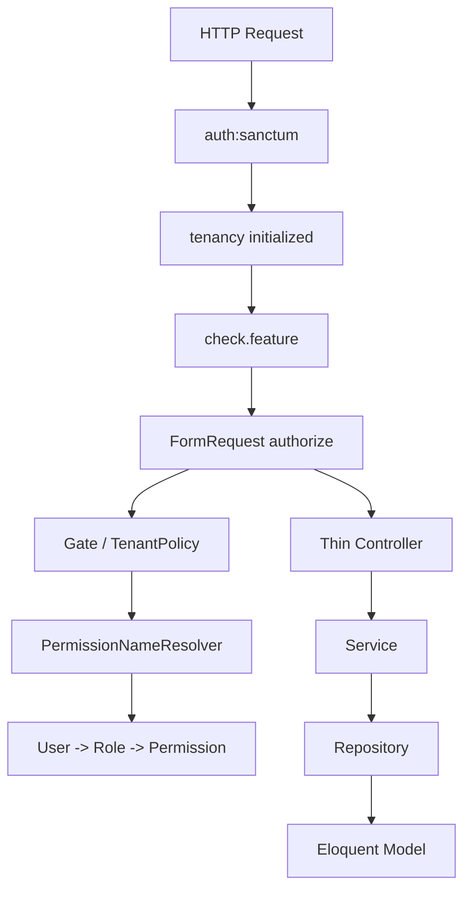

# Plano De Correcao Do Sistema De Permissoes

**Data:** 2026-05-12  
**Base:** [`docs/2026-05-11-analise-de-permissoes.md`](./2026-05-11-analise-de-permissoes.md)  
**Escopo:** backend Laravel multi-tenant, RBAC, feature gates, policies, FormRequests, middlewares e testes de arquitetura.  
**Objetivo:** corrigir falhas reais de autorizacao, reduzir bypasses, padronizar a aplicacao de permissoes e criar uma rede de testes que impeça regressao.

---

## 1. Resumo Executivo

O sistema atual possui uma base RBAC consistente, com permissoes canonicas, roles, planos e feature flags, mas a aplicacao pratica esta fragmentada. Os principais riscos sao: permissoes de sistema com submodulos nao sao reconhecidas corretamente, `PremissasViabilidade` esta fora do fluxo de authorization, alguns FormRequests tenant retornam `true`, rotas mutaveis nao aplicam `permission.gate`, `CheckFeature` falha aberto sem tenancy inicializada e `DIRECTOR` recebe acesso administrativo por middleware sem possuir permissao RBAC equivalente.

Este plano corrige esses problemas em seis fases: primeiro proteger a integridade das permissoes canonicas, depois integrar recursos invisiveis ao RBAC, fechar FormRequests permissivos, endurecer middlewares, adicionar testes de arquitetura e atualizar a documentacao.

---

## 2. Principios De Correcao

| Principio | Decisao |
|---|---|
| Menor privilegio | Remover bypasses implicitos e exigir permissao explicita para mutacoes |
| Fonte unica de autorizacao | Usar `Gate`, `Policy`, `FormRequest` e middlewares de forma consistente |
| Plano nao substitui RBAC | Feature flag libera capacidade contratual; permissao libera acao do usuario |
| Fail closed | Na duvida, negar acesso em vez de permitir |
| Sem pacote novo | Nao introduzir OPA, CASL ou bibliotecas externas nesta fase |
| Teste como contrato | Toda correcao critica deve ter teste Feature, Unit ou Architecture |
| Arquitetura do projeto | Preservar Controller -> Service -> Repository |

---

## 3. Matriz De Prioridade

| Prioridade | Item | Risco Atual | Resultado Esperado |
|---|---|---|---|
| P0 | Corrigir `PermissionRepository::isSystemPermission()` | Permissoes canonicas com submodulos podem ser tratadas como customizadas | Todas as 42 permissoes canonicas sao reconhecidas como sistema |
| P0 | Integrar `PremissasViabilidade` ao RBAC | Recurso invisivel para policies e FormRequests permissivos | Recurso autorizado por `viability.*` e protegido por feature flag |
| P0 | Fechar `authorize(): true` em mutations tenant | Usuario autenticado pode mutar dados sem permissao RBAC | Toda mutation tenant exige Gate real |
| P1 | Corrigir `CheckFeature` fail-open | Rotas tenant podem passar sem tenancy inicializada | Middleware nega acesso sem contexto tenant |
| P1 | Remover `DIRECTOR` de `tenant.admin` | Role sem `admin.*` consegue administrar usuarios/permissoes | Apenas admin canonico acessa admin tenant |
| P1 | Corrigir rotas `terreno-produtos` | Rotas sem feature gate e store permissivo | Rotas usam feature + RBAC consistente |
| P2 | Normalizar roles canonicas | `admin` minusculo pode funcionar como superadmin | Bypass usa apenas roles canonicas controladas |
| P2 | Ampliar testes de arquitetura | Regressao facil em novos FormRequests | CI falha quando authorization permissiva volta |

---

## 4. Arquitetura Alvo



Regra central: uma rota tenant mutavel so deve executar controller quando `auth`, tenancy, feature contractual e permissao RBAC tiverem sido validadas.

---

## 5. Fase 1 - Proteger Permissoes Canonicas

### Problema

`PermissionRepository::isSystemPermission()` compara `$resource` como string contra objetos `SubmodulesEnum` usando comparacao estrita. Isso faz com que permissoes como `prospection.terrains.viewer` e `prospection.maps.viewer` nao sejam reconhecidas como permissoes de sistema.

### Alteracao Recomendada

Arquivo principal:

- `app/Repositories/PermissionRepository.php`

Implementar a comparacao usando valores string dos enums:

```php
$submodules = array_map(
    static fn (SubmodulesEnum $submodule): string => $submodule->value,
    $mod->submodules(),
);

return $mod !== null
    && in_array($resource, $submodules, true)
    && in_array($level, $levels, true);
```

Tambem validar o fluxo para modulos sem submodulo, garantindo que permissoes como `viability.viewer`, `data.editor` e `admin.manager` continuem reconhecidas.

### Criterios De Aceite

| Criterio | Resultado Esperado |
|---|---|
| `prospection.terrains.viewer` | `isSystemPermission()` retorna `true` |
| `prospection.maps.editor` | `isSystemPermission()` retorna `true` |
| `viability.manager` | `isSystemPermission()` retorna `true` |
| `custom.permission.viewer` | `isSystemPermission()` retorna `false` |
| Rename/delete de permissao canonica | Bloqueado |

### Testes

Criar ou atualizar testes unitarios cobrindo:

- Todas as 42 permissoes canonicas.
- Permissoes com submodulos.
- Permissoes customizadas.
- Tentativa de renomear/remover permissao canonica com submodulo.

---

## 6. Fase 2 - Integrar PremissasViabilidade Ao RBAC

### Problema

`PremissasViabilidade` esta fora do desenho de autorizacao:

| Ponto | Estado Atual |
|---|---|
| `ModulesEnum::modelMap()` | Modelo ausente |
| Registro de policy | Modelo ausente em `AppServiceProvider::boot()` |
| Controller | Usa Eloquent direto |
| `StorePremissasViabilidadeRequest` | `authorize(): true` |
| `UpdatePremissasViabilidadeRequest` | `authorize(): true` |
| Feature flag | Rota usa apenas `viabilities.enabled` |

### Decisao De Dominio

`PremissasViabilidade` deve pertencer ao modulo RBAC `viability`, pois representa configuracao operacional do motor de viabilidade.

As rotas publicas de premissas devem exigir a feature flag `viabilities.premises`, pois essa flag ja existe no desenho de planos e expressa a liberacao contractual especifica do recurso.

### Alteracoes Recomendadas

Arquivos principais:

- `app/Enums/Common/ModulesEnum.php`
- `app/Providers/AppServiceProvider.php`
- `app/Http/Controllers/Api/V1/Tenant/PremissasViabilidadeController.php`
- `app/Http/Requests/Tenant/PremissasViabilidade/*`
- `app/Services/Tenant/Viabilidade/v1/PremissasViabilidadeService.php`
- `app/Repositories/Tenant/Viabilidade/v1/PremissasViabilidadeRepository.php`

Adicionar `PremissasViabilidade::class` ao mapeamento do modulo `viability`.

Registrar a policy tenant para o model.

Trocar `authorize(): true` por Gate real:

| Operacao | Permissao Alvo |
|---|---|
| `index` / `show` | `viability.viewer` |
| `store` | `viability.editor` |
| `update` | `viability.editor` |
| `destroy` | `viability.manager` |

Refatorar controller para delegar a Service e Repository, removendo `query()`, `find()`, `create()`, `update()` e `delete()` diretos no controller.

### Criterios De Aceite

| Criterio | Resultado Esperado |
|---|---|
| Usuario sem `viability.*` | 403 em todas as rotas protegidas |
| Usuario com `viability.viewer` | Pode listar/visualizar |
| Usuario com `viability.editor` | Pode criar/atualizar |
| Usuario com `viability.manager` | Pode remover |
| Plano sem `viabilities.premises` | 403 antes da execucao do controller |
| Controller | Sem Eloquent direto |

### Testes

Criar testes Feature para:

- Viewer consegue ler e nao consegue mutar.
- Editor consegue criar e atualizar.
- Manager consegue deletar.
- Usuario sem permissao recebe 403.
- Plano sem `viabilities.premises` recebe 403.

Criar teste de arquitetura garantindo que `PremissasViabilidadeController` nao usa Eloquent diretamente.

---

## 7. Fase 3 - Fechar FormRequests Tenant Permissivos

### Problema

Alguns FormRequests de rotas tenant mutaveis retornam `true`, contrariando a regra do projeto de que `authorize()` deve verificar permissoes reais.

### Correcoes Obrigatorias

| FormRequest | Estado Atual | Correcao |
|---|---|---|
| `StoreRegionalRequest` | `true` | `Gate::allows('create', Regional::class)` |
| `StoreTerrenoProdutoRequest` | `true` | `Gate::allows('create', TerrenoProduto::class)` |
| `StorePremissasViabilidadeRequest` | `true` | `Gate::allows('create', PremissasViabilidade::class)` |
| `UpdatePremissasViabilidadeRequest` | `true` | `Gate::allows('update', $premissas)` ou `Gate::allows('update', PremissasViabilidade::class)` conforme binding |
| `ListMobileNotificationsRequest` | `true` | Exigir usuario autenticado e escopo do proprio usuario |
| `StoreVeiculoRequest` | `true` | Corrigir se rota ativa; se legado, documentar allowlist temporaria |
| `UpdateVeiculoRequest` | `true` | Corrigir se rota ativa; se legado, documentar allowlist temporaria |
| `StoreRequisicaoVeiculoRequest` | `true` | Corrigir se rota ativa; se legado, documentar allowlist temporaria |
| `SalvarTermoDeUsoVersaoRequest` | `true` | Corrigir se rota ativa; se legado, documentar allowlist temporaria |

### Decisao Para Requests Legados

Requests que nao estiverem referenciados por rotas ativas nao devem bloquear o P0. Eles devem entrar em allowlist temporaria de teste de arquitetura com comentario explicando:

- Por que ainda existem.
- Qual rota ou modulo legado dependia deles.
- Qual ticket/fase remove ou corrige o request.

### Criterios De Aceite

| Criterio | Resultado Esperado |
|---|---|
| Mutation tenant ativa | Nunca usa `authorize(): true` |
| Request legado | Allowlist documentada |
| Nova mutation tenant | CI falha se `authorize()` for permissivo |

---

## 8. Fase 4 - Corrigir Rotas E Middlewares

### 8.1 Rotas De `terreno-produtos`

Problema: as rotas de `terreno-produtos` nao aplicam `check.feature` nem `permission.gate`, e `StoreTerrenoProdutoRequest` retorna `true`.

Decisao:

| Aspecto | Decisao |
|---|---|
| Modulo RBAC | `data`, seguindo mapeamento atual de `TerrenoProduto` |
| Feature flag | `product_settings` |
| Criacao | `data.editor` |
| Atualizacao | `data.editor` |
| Remocao | `data.manager` |

Resultado esperado: qualquer usuario autenticado sem permissao `data.editor` nao consegue criar ou atualizar vinculo de produto em terreno.

### 8.2 Rotas De Premissas

Problema: usam feature generica de viabilidade e nao aplicam RBAC efetivo.

Decisao:

| Aspecto | Decisao |
|---|---|
| Feature flag | `viabilities.premises` |
| Modulo RBAC | `viability` |
| Criacao/edicao | `viability.editor` |
| Remocao | `viability.manager` |

### 8.3 `CheckFeature`

Problema: se tenancy nao esta inicializada, o middleware permite a requisicao.

Alteracao recomendada:

- Em rotas tenant, retornar 403 quando `tenancy()->initialized` for falso.
- Usar resposta padronizada com codigo semantico, por exemplo `TENANT_CONTEXT_REQUIRED`.
- Nao criar excecao para rotas centrais nesta fase, pois `check.feature` deve ser usado apenas em contexto tenant.

### 8.4 `EnsureTenantAdmin`

Problema: `DIRECTOR` e `director` entram como administradores tenant mesmo sem permissoes `admin.*`.

Alteracao recomendada:

- Permitir apenas role canonica `ADMIN`.
- Remover suporte a `admin` minusculo do bypass administrativo.
- Se houver dados legados com role minuscula, criar etapa de auditoria/migracao antes do deploy produtivo.

### 8.5 `User::isAdmin()` E Bypasses

Problema: bypasses aceitam `ADMIN` e `admin`.

Alteracao recomendada:

- Padronizar bypass para `ADMIN` canonico.
- Impedir criacao de roles customizadas com nomes reservados case-insensitive.
- Criar teste cobrindo `admin` minusculo para garantir que nao atua como superadmin.

---

## 9. Fase 5 - Testes De Arquitetura

### Objetivo

Criar uma barreira automatica para impedir que novos endpoints tenant mutaveis entrem com autorizacao permissiva.

### Regras De Arquitetura

| Regra | Resultado Esperado |
|---|---|
| Controller tenant nao usa Eloquent direto | CI falha se controller chamar Model/query builder diretamente |
| Mutation tenant usa FormRequest | CI falha se controller mutavel receber `Request` generico |
| FormRequest tenant mutavel nao retorna `true` | CI falha sem Gate/policy real |
| Requests legados precisam de allowlist | CI exige comentario explicito |
| Rotas tenant sensiveis usam feature gate | CI ou teste Feature cobre ausencia de feature |

### Testes Recomendados

Arquivos sugeridos:

- `tests/Architecture/TenantAuthorizationArchitectureTest.php`
- `tests/Unit/Repositories/PermissionRepositoryTest.php`
- `tests/Feature/Tenant/PremissasViabilidadeAuthorizationTest.php`
- `tests/Feature/Tenant/TerrenoProdutoAuthorizationTest.php`
- `tests/Feature/Tenant/RegionalAuthorizationTest.php`
- `tests/Feature/Tenant/Middleware/CheckFeatureTest.php`
- `tests/Feature/Tenant/Admin/EnsureTenantAdminTest.php`

### Comandos De Validacao

```bash
php artisan test
./vendor/bin/phpstan analyse
```

---

## 10. Fase 6 - Atualizacao Da Documentacao

### Documentos Afetados

| Documento | Alteracao |
|---|---|
| `docs/2026-05-11-analise-de-permissoes.md` | Adicionar link para este plano de correcao |
| `docs/2026-05-12-plano-correcao-sistema-permissoes.md` | Manter como plano executivo de remediacao |

### Conteudo Que Deve Ser Mantido Atualizado

- Matriz rota -> feature -> permissao.
- Lista de FormRequests com autorizacao real.
- Lista de allowlist temporaria, se existir.
- Decisoes de dominio sobre `DIRECTOR`, `PremissasViabilidade` e `TerrenoProduto`.
- Resultado dos testes adicionados.

---

## 11. Matriz De Permissoes Alvo Para Recursos Corrigidos

| Recurso | Feature Flag | Viewer | Editor | Manager |
|---|---|---|---|---|
| `PremissasViabilidade` | `viabilities.premises` | Listar/visualizar | Criar/atualizar | Remover |
| `TerrenoProduto` | `product_settings` | Listar/visualizar quando aplicavel | Criar/atualizar vinculo | Remover vinculo |
| `Regional` | `regionals` | Listar/visualizar | Criar/atualizar | Remover |
| Permissoes canonicas | N/A | N/A | N/A | Protegidas contra rename/delete |
| Admin tenant | N/A | N/A | N/A | Apenas `ADMIN` canonico |

---

## 12. Sequencia Recomendada De Implementacao

```mermaid
flowchart LR
    A["P0: corrigir isSystemPermission"]
    B["P0: testes de permissoes canonicas"]
    C["P0: mapear PremissasViabilidade"]
    D["P0: FormRequests com Gate"]
    E["P1: feature gates e middlewares"]
    F["P1: remover bypass DIRECTOR/admin"]
    G["P2: architecture tests"]
    H["Validacao: test + phpstan"]

    A --> B
    B --> C
    C --> D
    D --> E
    E --> F
    F --> G
    G --> H
```



---

## 13. Riscos De Rollout

| Risco | Impacto | Mitigacao |
|---|---|---|
| Usuarios `DIRECTOR` deixam de acessar admin tenant | Pode quebrar fluxo operacional existente | Comunicar mudanca e criar permissao/admin role explicita se necessario |
| Planos sem `viabilities.premises` perdem acesso a premissas | Mudanca de comportamento em clientes existentes | Validar contratos ativos antes do deploy |
| Roles minusculas legadas perdem bypass | Usuarios antigos podem perder privilegio | Auditar base antes de remover suporte |
| Tests revelam controllers com Eloquent direto fora do escopo | Pode ampliar refatoracao | Corrigir P0 primeiro e abrir backlog para cleanup restante |
| Feature flags mal nomeadas no banco | Rotas podem negar indevidamente | Criar seed/test de entitlements antes do deploy |

---

## 14. Definition Of Done

| Area | Criterio |
|---|---|
| RBAC | Todas as permissoes canonicas, incluindo submodulos, sao protegidas como sistema |
| Premissas | `PremissasViabilidade` passa por feature flag, Gate, Policy, Service e Repository |
| FormRequests | Nenhuma mutation tenant ativa usa `authorize(): true` |
| Middlewares | `CheckFeature` falha fechado e `EnsureTenantAdmin` nao aceita `DIRECTOR` por bypass |
| Rotas | `terreno-produtos` e `premissas` possuem feature gate e RBAC coerente |
| Testes | Unit, Feature e Architecture cobrem os cenarios criticos |
| Qualidade | `php artisan test` e `./vendor/bin/phpstan analyse` passam |
| Documentacao | Auditoria e plano ficam cruzados por link |

---

## 15. Fora De Escopo Desta Fase

| Item | Motivo |
|---|---|
| Introduzir OPA, CASL ou motor externo de policy | A correcao deve estabilizar primeiro o desenho Laravel atual |
| Redesenhar todos os planos comerciais | Este plano usa flags existentes |
| Implementar ABAC por departamento/cargo | Departamentos e cargos ainda sao metadados sem regra de autorizacao |
| Refatorar todos os controllers do backend | O foco e corrigir falhas de autorizacao identificadas |
| Migrar toda autorizacao para permissions string-only | A base atual ja usa Gates/Policies e deve ser consolidada antes |

---

## 16. Checklist Operacional

- [ ] Corrigir `PermissionRepository::isSystemPermission()`.
- [ ] Testar todas as 42 permissoes canonicas.
- [ ] Mapear `PremissasViabilidade` em `ModulesEnum`.
- [ ] Registrar policy tenant para `PremissasViabilidade`.
- [ ] Refatorar `PremissasViabilidadeController` para Service/Repository.
- [ ] Corrigir `StorePremissasViabilidadeRequest`.
- [ ] Corrigir `UpdatePremissasViabilidadeRequest`.
- [ ] Corrigir `StoreRegionalRequest`.
- [ ] Corrigir `StoreTerrenoProdutoRequest`.
- [ ] Aplicar feature gate em rotas `terreno-produtos`.
- [ ] Trocar premissas para `check.feature:viabilities.premises`.
- [ ] Alterar `CheckFeature` para fail closed sem tenancy.
- [ ] Remover `DIRECTOR` e roles minusculas do bypass administrativo.
- [ ] Criar testes Feature para recursos corrigidos.
- [ ] Criar testes Architecture para FormRequests tenant.
- [ ] Rodar `php artisan test`.
- [ ] Rodar `./vendor/bin/phpstan analyse`.
- [ ] Atualizar a auditoria com link para este plano.

