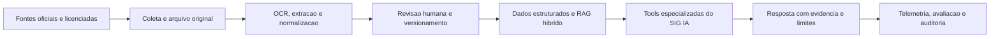

# Plano de Evolucao do SIG IA: Inteligencia Regulatoria, Economica e de Mercado

**Data:** 13 de julho de 2026  
**Status:** proposto — nao iniciado  
**Escopo:** backend SIGAPP, agente `SIG_IA`, base de conhecimento, integracoes de dados, observabilidade e avaliacao  
**Responsaveis necessarios:** Produto, Engenharia, Juridico/Urbanismo, Engenharia de Custos e Dados  
**Documentos de referencia:**

- `AGENTS.md`
- `docs/ia.md`
- `app/Services/Ai/Agents/SIG_IA.php`
- `app/Services/Ai/Tools/`
- resumo legislativo recebido em 13/07/2026

---

## 1. Objetivo

Transformar o SIG IA em um assistente confiavel de inteligencia imobiliaria, capaz de apoiar prospeccao, viabilidade e comite com:

1. legislacao federal, estadual e municipal citada e versionada;
2. regras urbanisticas estruturadas por municipio, zona e vigencia;
3. indicadores economicos e de custo com competencia e metodologia explicitas;
4. observacoes de concorrentes rastreaveis, datadas e classificadas por confianca;
5. respostas que explicitem fontes, limitacoes e proximo passo de validacao humana.

O resultado nao sera um parecer juridico, uma aprovacao municipal ou um orcamento executivo. O SIG IA sera uma camada de triagem, pesquisa e evidencia para acelerar o trabalho dos especialistas.

---

## 2. Principios e limites obrigatorios

1. **Dados, nao memoria de prompt.** Legislacao, indices e mercado nao devem ser gravados como conhecimento estatico no prompt do modelo.
2. **Rastreabilidade obrigatoria.** Toda afirmacao regulatoria precisa indicar fonte, artigo ou pagina, jurisdicao e vigencia. Todo valor economico precisa indicar competencia, localidade, dimensoes e fonte.
3. **Fonte oficial antes de fonte secundaria.** Planalto, Diario Oficial e orgaos municipais prevalecem sobre resumos, blogs e anuncios.
4. **Versionamento imutavel.** Um indice importado ou documento consultado no passado permanece reproduzivel; atualizacoes criam nova versao, nunca sobrescrevem a anterior.
5. **Estruturacao antes de geracao.** Regras como lote minimo, coeficiente e recuos devem existir em campos estruturados e manter a evidencia textual de origem.
6. **Revisao humana para regra publicada.** A IA pode extrair uma proposta; somente responsavel juridico ou urbanistico aprova a publicacao.
7. **Separacao de evidencias.** Anuncio imobiliario nao prova aprovacao, registro, numero de unidades ou situacao juridica.
8. **Privacidade e isolamento tenant.** Dados publicos e licenciados ficam em catalogo central; conversas, documentos privados e relatorios continuam isolados por tenant.
9. **Sem navegacao aberta pelo modelo.** O agente consulta apenas tools e fontes registradas; ele nao deve concluir fatos a partir de pesquisa web livre.
10. **Resposta conservadora.** Ausencia de evidencia deve produzir incerteza e uma lista de documentos a confirmar, nunca uma conclusao inventada.

---

## 3. Decisoes de arquitetura

### 3.1 Separacao de dominios

| Dominio | Natureza | Contexto de dados | Atualizacao |
|---|---|---|---|
| Legislacao federal | publica, versionada | central | semanal e por alerta |
| Legislacao estadual/municipal | publica, territorial | central | diaria/semanal conforme fonte |
| Indicadores economicos | publico ou licenciado | central | mensal |
| Inteligencia competitiva | publico/licenciado, observacional | central com controle de acesso | diaria/semanal |
| Conversas, estudos e relatorios | privado do cliente | tenant | sob demanda |

O catalogo central deve alimentar todos os tenants sem misturar dados privados. Dados internos de um tenant nao podem enriquecer respostas de outro tenant sem autorizacao contratual e tecnica explicita.

### 3.2 Fluxo de dados



### 3.3 Componentes a introduzir

- **Registro de fontes:** proprietario, licenca, periodicidade, URL, tipo de dado e politica de retencao.
- **Ingestao documental:** download controlado, checksum, armazenamento S3, OCR, extracao de estrutura e controle de versao.
- **Base estruturada:** regras urbanisticas, indicadores e observacoes de mercado com dimensoes normalizadas.
- **RAG hibrido:** filtro estrutural + busca textual + busca vetorial + reranqueamento + citacoes.
- **Fila de revisao:** itens extraidos pela IA ficam pendentes ate aprovacao de especialista.
- **Tools tipadas:** entradas e saidas estruturadas, sem acesso direto do modelo a banco ou web.
- **Observabilidade:** telemetria por fonte, tool, latencia, custo, falha, cobertura e qualidade.

---

## 4. Fontes e politica de confianca

### 4.1 Fontes prioritarias

| Dado | Fonte primaria | Observacao operacional |
|---|---|---|
| Lei federal | Planalto e Diario Oficial da Uniao | usar texto consolidado e registrar alteracoes |
| Lei municipal | Prefeitura, Camara e Diario Oficial municipal | validar autenticidade e vigencia |
| Plano Diretor e mapas | Prefeitura e geosservicos oficiais | guardar versao do mapa e sistema de coordenadas |
| IPCA | IBGE/SIDRA | informar abrangencia geografica real |
| SINAPI | CAIXA/IBGE | guardar UF, competencia, composicao e condicao aplicavel |
| INCC | FGV IBRE | validar licenca, serie e janela de divulgacao |
| CUB | Sinduscon estadual; CBIC se licenciado | guardar UF, projeto-padrao e desoneracao |
| Concorrentes | APIs/portais autorizados, incorporadoras e atos publicos | nao presumir aprovacao a partir de anuncio |

### 4.2 Escala de confianca

| Nivel | Evidencia | Uso permitido |
|---|---|---|
| A | ato oficial, Diario Oficial, lei, alvara ou dado do orgao responsavel | regra ou fato confirmado |
| B | fonte oficial de incorporadora, registro ou API contratada | fato de mercado com fonte |
| C | portal, corretora identificada ou imprensa especializada | observacao de mercado a confirmar |
| D | anuncio individual, agregador sem origem ou dado sem data | apenas sinal exploratorio; nao fundamenta conclusao |

Uma resposta que use fontes C ou D precisa declarar a limitacao no texto final.

---

## 5. Modelo de dados minimo

### 5.1 Catalogo e legislacao

```text
knowledge_sources
  id, name, authority, source_type, official_url, license_status,
  refresh_policy, trust_level, active

legal_documents
  id, source_id, territory_type, country, state, city_ibge_code,
  law_number, title, subject, official_url, published_at,
  effective_from, effective_to, current_status

legal_document_versions
  id, legal_document_id, version_hash, raw_file_path, extracted_text,
  retrieved_at, supersedes_version_id, review_status, reviewer_id

legal_chunks
  id, version_id, book, chapter, article, paragraph, page,
  content, embedding, searchable_text

urban_rules
  id, city_ibge_code, state, zone_code, rule_type, value,
  unit, conditions, effective_from, effective_to,
  legal_chunk_id, review_status, reviewer_id
```

`urban_rules` deve suportar, no minimo: uso permitido, lote minimo, frente minima, coeficiente de aproveitamento, taxa de ocupacao, gabarito, recuos, permeabilidade, areas publicas, EIV, documentos e restricoes ambientais.

### 5.2 Indicadores economicos

```text
economic_indicators
  id, code, name, provider, methodology_url, licensing_notes

economic_indicator_snapshots
  id, indicator_id, reference_month, published_at, geography_type,
  geography_code, state, project_standard, payroll_desoneration,
  component, unit, value, monthly_change, yearly_change,
  source_url, raw_file_path, imported_at, version_hash
```

Nao usar uma tabela unica de "valor atual". A consulta deve sempre selecionar um snapshot por dimensoes completas.

### 5.3 Concorrentes

```text
market_projects
  id, canonical_name, developer_name, city_ibge_code, state,
  address, latitude, longitude, product_type, lifecycle_status,
  confidence_level, last_verified_at

market_project_observations
  id, market_project_id, source_id, observed_at, source_url,
  source_excerpt, advertised_price_min, advertised_price_max,
  unit_count, area_min, area_max, lifecycle_status,
  raw_payload_path, confidence_level, review_status
```

As observacoes permanecem historicas. A entidade canonica consolida o entendimento atual, mas deve apontar para todas as evidencias que a sustentam.

---

## 6. Fases de execucao

### Fase 0 — Governanca, escopo e baseline

**Objetivo:** definir o piloto e impedir que tecnologia avance sem fonte, dono e criterio de qualidade.

**Atividades:**

1. Escolher de tres a cinco cidades-piloto e registrar codigo IBGE.
2. Priorizar tipos de produto: loteamento, loteamento de acesso controlado, condominio de lotes, incorporacao residencial e MCMV, se aplicavel.
3. Nomear responsavel juridico/urbanistico, responsavel de custos, responsavel de produto e dono tecnico.
4. Criar matriz RACI de coleta, revisao, publicacao e correcao.
5. Inventariar fontes, termos de uso, APIs e eventuais assinaturas da FGV, CBIC e portais.
6. Definir SLA de atualizacao e politica de desativacao de fonte.
7. Montar conjunto inicial de perguntas de avaliacao validado por especialistas.

**Entregaveis:** matriz de escopo, RACI, registro de fontes inicial, criterios de aceite e conjunto de perguntas.

**Criterio de aceite:** nenhuma fonte ou regra entra no sistema sem dono, licenca, jurisdcao e frequencia definidos.

### Fase 1 — Fundacao tecnica e governanca de dados

**Objetivo:** criar armazenamento, versionamento, revisao e auditoria antes de importar conteudo em escala.

**Atividades:**

1. Criar migrations centrais para fontes, documentos, versoes, chunks, regras, snapshots e observacoes.
2. Implementar repositorios e services seguindo Controller -> Service -> Repository.
3. Armazenar arquivos originais no disk S3 com checksum e metadados.
4. Criar jobs idempotentes de coleta, extracao, indexacao e revisao.
5. Registrar `retrieved_at`, `published_at`, `effective_from`, hash e versao do extrator/modelo.
6. Criar tela ou API administrativa para aprovar, rejeitar e substituir extracoes.
7. Proteger alteracoes administrativas com RBAC, log de auditoria e dupla confirmacao para exclusao.

**Criterio de aceite:** um documento oficial pode ser importado, revisado, publicado, substituido por nova versao e reproduzido posteriormente.

### Fase 2 — Corpus legal federal revisado

**Objetivo:** disponibilizar uma base federal confiavel e citavel antes da expansao municipal.

**Atividades:**

1. Catalogar Lei 6.766/1979, Estatuto da Cidade, Lei 4.591/1964, Codigo Civil, Lei de Registros Publicos, alienacao fiduciaria, REURB, normas ambientais, acessibilidade, mobilidade, saneamento e habitacao relevantes.
2. Coletar somente o texto oficial e suas alteracoes consolidadas.
3. Dividir documentos por livro, capitulo, artigo, inciso e paragrafo; nao usar chunks arbitrarios como unica estrutura.
4. Extrair temas: parcelamento, condominio, incorporacao, registro, aprovacao, ambiente, risco, acessibilidade e financiamento.
5. Revisar juridicamente o resumo operativo de cada norma.
6. Criar alertas de alteracao por hash e por monitoramento do Diario Oficial/Planalto.

**Regra especial:** nao cadastrar como regra federal percentuais ou exigencias que a legislacao delega ao Plano Diretor ou a lei municipal. A Lei 6.766/1979 deve ser tratada em conjunto com a jurisdicao local.

**Criterio de aceite:** perguntas federais prioritarias retornam artigo/pagina, URL oficial, versao e limites de aplicacao.

### Fase 3 — Dossie municipal das cidades-piloto

**Objetivo:** permitir triagem territorial real, sem confundir diretriz federal com parametro urbano local.

**Atividades por cidade:**

1. Coletar Plano Diretor, uso e ocupacao do solo, parcelamento, Codigo de Obras, posturas, EIV, licenciamento, legislacao ambiental e mapas oficiais.
2. Definir a chave de zona oficial e tratar alteracoes de nomenclatura.
3. Extrair e revisar os parametros de zona para cada tipo de projeto.
4. Registrar documentos necessarios, fluxo de aprovacao, orgaos e taxas quando publicados oficialmente.
5. Registrar lacunas: mapas indisponiveis, lei revogada sem consolidacao, conflito de fontes ou regra que exija interpretacao tecnica.
6. Criar rotina de revisao de Diario Oficial para cada cidade.

**Criterio de aceite por cidade:** cobertura revisada de Plano Diretor, zoneamento, parcelamento, codigo de obras, rito de aprovacao e fontes cartograficas; lacunas expostas no painel.

### Fase 4 — Indicadores economicos e de custo

**Objetivo:** responder valores atuais e historicos de forma reproduzivel e metodologicamente correta.

**Atividades:**

1. Implementar importador mensal do IPCA via IBGE/SIDRA, incluindo abrangencia geografica e acumulados.
2. Implementar importador do SINAPI por UF, competencia, insumo/composicao e condicao divulgada.
3. Validar contrato/licenca do INCC; integrar a serie contratada, especificando INCC-M ou outra serie suportada.
4. Integrar CUB por Sinduscon/UF, mantendo projeto-padrao, desoneracao e fonte estadual.
5. Criar calculadora de reajuste que grave parametros e snapshots usados.
6. Criar alerta para atraso de publicacao e mecanismo de "ultimo dado disponivel" claramente marcado.

**Criterio de aceite:** toda resposta de indicador inclui valor, competencia, publicacao, dimensoes, fonte, metodologia e URL; a mesma consulta historica retorna o mesmo snapshot.

### Fase 5 — Inteligencia competitiva

**Objetivo:** converter busca de mercado em dados observacionais, e nao em textos efemeros de web search.

**Atividades:**

1. Mapear fontes permitidas e validar contratos/termos de uso antes de automatizar coleta.
2. Coletar observacoes com URL, trecho de evidencia, data, payload bruto e nivel de confianca.
3. Geocodificar com precisao declarada e normalizar nomes de incorporadoras.
4. Deduplicar por endereco, coordenadas, nome, incorporadora e caracteristicas do produto.
5. Separar `planejado`, `lancado`, `em obras`, `entregue` e `nao confirmado`.
6. Criar revisao humana para empreendimentos com conflito de dados ou relevancia alta.
7. Proibir que anuncio isolado altere status para "aprovado" ou "registrado".

**Criterio de aceite:** cada concorrente retornado possui fonte, data observada, confianca, cobertura declarada e evidencia visual/textual armazenada quando permitido.

### Fase 6 — RAG hibrido e tools especializadas

**Objetivo:** fazer o SIG IA consultar dados corretamente e responder de forma estruturada.

**Tools propostas:**

| Tool | Entrada obrigatoria | Saida obrigatoria |
|---|---|---|
| `consultar_legislacao_urbanistica` | codigo IBGE, tipo de projeto, zona quando conhecida, data | regra, fonte, artigo/pagina, vigencia, confianca, lacunas |
| `consultar_indicadores_construcao` | UF, competencia, indicador, projeto-padrao/desoneracao quando aplicavel | valor, unidade, dimensoes, fonte, metodologia, data de publicacao |
| `pesquisar_concorrentes` | cidade/raio, produto, faixa/preco, periodo | observacoes, fontes, datas, confianca e cobertura |
| `avaliar_previabilidade_territorial` | terreno, projeto e data de referencia | triagem, fatos, pendencias e ferramentas/fontes usadas |

**Roteamento de consulta:**

1. validar parametros e contexto tenant;
2. filtrar por territorio, vigencia, tipo de fonte e permissao;
3. recuperar campos estruturados;
4. executar busca textual e vetorial apenas no corpus elegivel;
5. reranquear por autoridade, vigencia e relevancia;
6. retornar evidencias estruturadas ao agente;
7. gerar resposta com citacoes e declaracao de limitacoes.

**Criterio de aceite:** o agente nao pode responder parametro legal ou economico sem evidencia retornada pela tool correspondente.

### Fase 7 — Seguranca, observabilidade e custo

**Objetivo:** expandir as protecoes atuais do SIG IA para os novos fluxos de dados.

**Atividades:**

1. Preservar redacao de dados sensiveis antes de chamadas a providers externos.
2. Tratar documentos externos como dados, nunca como instrucoes para o modelo.
3. Registrar fonte, versao, tool, usuario, tenant, latencia, tokens, custo e resultado de cada consulta.
4. Medir falhas de coleta, frescor, cobertura, taxa de "nao localizado" e taxa de revisao humana.
5. Aplicar rate limit e budget por tenant tambem a consultas caras e geracoes longas.
6. Cachear respostas apenas quando chave incluir jurisdicao, versao da fonte, competencia e permissoes.
7. Definir circuito de degradacao: se fonte esta indisponivel, informar indisponibilidade; nao recorrer a dado nao verificado.

**Criterio de aceite:** cada resposta importante pode ser auditada ate a fonte e versao utilizadas, sem expor dados privados entre tenants.

### Fase 8 — Avaliacao, piloto e expansao

**Objetivo:** provar utilidade e seguranca antes de disponibilizar a todos os clientes.

**Atividades:**

1. Criar conjunto de avaliacao com perguntas e respostas aprovadas por juridico, urbanismo e custos.
2. Criar testes de regressao para citacao, jurisdicao, vigencia, competencia economica e recusa por falta de fonte.
3. Testar prompt injection em PDFs, paginas e documentos com instrucoes maliciosas.
4. Rodar piloto interno com analistas de viabilidade.
5. Corrigir erros por categoria antes de habilitar tenants externos.
6. Liberar para grupo controlado de tenants e revisar semanalmente as respostas reprovadas.
7. Expandir cidade a cidade, somente quando a cobertura minima estiver atendida.

**Criterio de aceite:** metas de qualidade atingidas durante quatro ciclos semanais consecutivos no piloto.

---

## 7. Contrato de resposta do SIG IA

Toda resposta que envolva legislacao, custo ou concorrencia deve seguir esta estrutura:

1. **Conclusao curta:** o que foi localizado e se e suficiente para triagem.
2. **Contexto:** municipio/UF, zona se conhecida e data de referencia.
3. **Evidencias:** regras, valores ou observacoes recuperadas.
4. **Fontes:** URL, documento, artigo/pagina, competencia e data de consulta.
5. **Limitacoes:** lacunas, baixa confianca, documento pendente de revisao ou cobertura parcial.
6. **Proximo passo:** documento, orgao ou especialista que deve validar a decisao.

Exemplo de postura esperada:

> Foi localizada regra aplicavel a cidade e zona informadas, vigente na data de referencia. A resposta e uma triagem automatizada baseada nas fontes citadas; a aprovacao do projeto depende de analise municipal e validacao tecnico-juridica.

---

## 8. Metricas e criterios de qualidade

| Metrica | Meta do piloto | Metodo de verificacao |
|---|---:|---|
| Resposta legal com fonte, vigencia e jurisdicao | 100% | teste automatizado de contrato |
| Resposta economica com competencia e fonte | 100% | teste automatizado de contrato |
| Jurisdicao municipal correta | >= 99% | conjunto de avaliacao revisado |
| Recuperacao de documento relevante no top 5 | >= 90% | benchmark de perguntas legais |
| Concorrente com fonte e data observada | 100% | validacao de schema |
| Precisao de concorrentes revisados | >= 90% | amostragem humana |
| Deteccao de alteracao em fonte legal | ate 7 dias | monitoramento de hash/SLA |
| Novo indicador mensal importado | ate 2 dias uteis apos publicacao | job e painel de frescor |
| Latencia p95 de consulta cacheada | < 8 segundos | telemetria |
| Latencia p95 sem cache | < 20 segundos | telemetria |
| Resposta sem fonte inventada | 0 ocorrencias | avaliacao adversarial |

As metas de 100% sao requisitos de formato e rastreabilidade, nao promessas de que toda fonte externa estara sempre disponivel. Quando a fonte faltar, a resposta correta e declarar indisponibilidade.

---

## 9. Backlog tecnico inicial

1. Criar ADR para armazenamento central de inteligencia publica/licenciada.
2. Criar migrations e models centrais do catalogo de fontes, documentos, versoes e snapshots.
3. Criar repositorios, services e jobs idempotentes de ingestao.
4. Implementar importador de IPCA e testes de historico/reproducao.
5. Implementar importador de SINAPI e testes por UF/competencia.
6. Criar ferramenta `consultar_indicadores_construcao`.
7. Criar corpus federal com revisao juridica e ferramenta de consulta citada.
8. Implementar dossie municipal da primeira cidade-piloto.
9. Criar persistencia de observacoes de concorrentes e deduplicacao.
10. Implementar ferramentas de concorrencia e previabilidade territorial.
11. Adicionar painel administrativo de fontes, revisoes, cobertura e frescor.
12. Criar suite de avaliacao, testes adversariais e rollout controlado.

---

## 10. Dependencias e bloqueios

| Dependencia | Impacto | Acao necessaria |
|---|---|---|
| Cidades-piloto | bloqueia dossie municipal e avaliacao real | produto deve priorizar municipios |
| Responsavel juridico/urbanistico | bloqueia publicacao de regras | definir revisor e SLA |
| Licenca INCC/CUB/portais | bloqueia automacao de algumas fontes | contratar ou limitar a fontes publicas permitidas |
| PDFs/mapas oficiais acessiveis | reduz qualidade de extracao | criar fila de coleta e revisao manual |
| Definicao de produto-padrao | bloqueia interpretacao de CUB | engenharia de custos deve aprovar mapeamento |
| Dados geograficos confiaveis | afeta concorrencia e zoneamento | definir geocodificador e precisao minima |

Nao iniciar scraping de portais ou uso de conteudo restrito sem validacao juridica/contratual.

---

## 11. Riscos e mitigacoes

| Risco | Mitigacao |
|---|---|
| Lei municipal desatualizada ou sem consolidacao | guardar versao original, vigencia, fonte e pendencia de revisao |
| Hallucinacao do modelo | tool-only, citacao obrigatoria e recusa sem evidencia |
| Parametro urbano aplicado na cidade errada | filtro por codigo IBGE e testes de jurisdicao |
| Valor economico sem dimensao correta | schema obrigatorio para UF, competencia, serie e projeto-padrao |
| Uso indevido de dados licenciados | registro de licenca, controles de acesso e politica de exibicao |
| Dados de concorrentes duplicados | entidade canonica + observacoes historicas + fila de revisao |
| Prompt injection em PDF/site | tratar conteudo externo como dado e filtrar instrucoes |
| Custo/latencia excessivos | cache versionado, jobs assincronos e limites por tenant |
| Falsa sensacao de aprovacao | linguagem de triagem e proximo passo obrigatorios |

---

## 12. Ordem recomendada de entrega

1. Fase 0: cidades-piloto, responsaveis, licencas e perguntas de avaliacao.
2. Fase 1: catalogo de fontes, versionamento e fila de revisao.
3. Fase 4 parcial: IPCA e SINAPI, que possuem fonte publica oficial clara.
4. Fase 2: corpus federal revisado e consulta citada.
5. Fase 3: primeira cidade-piloto completa.
6. Fase 6: tools regulatoria e economica integradas ao SIG IA.
7. Fase 5: base de concorrentes e deduplicacao.
8. Fases 7 e 8: avaliacao, piloto controlado e expansao.
9. INCC e CUB entram apos a definicao de licenca, serie e mapeamento de dimensoes.

O primeiro marco de valor deve ser uma unica cidade-piloto completa: regras municipais revisadas, legislacao federal citada, IPCA/SINAPI consultaveis e concorrentes com evidencia. So depois disso a cobertura deve ser repetida para as demais cidades.

---

## 13. Proximo passo de decisao

Para iniciar a implementacao, Produto e diretoria devem definir:

1. as tres a cinco cidades-piloto, em ordem de prioridade;
2. os tipos de empreendimento que cada cidade deve cobrir primeiro;
3. o responsavel juridico/urbanistico que aprovara regras extraidas;
4. se a empresa possui ou deseja contratar acesso licenciado para INCC, CUB e dados de mercado;
5. a prioridade entre velocidade de cobertura e profundidade de revisao por cidade.

Com essas decisoes, a primeira entrega tecnica deve ser o catalogo central de fontes e snapshots, seguida pela consulta de IPCA/SINAPI e pelo corpus legislativo federal revisado.
