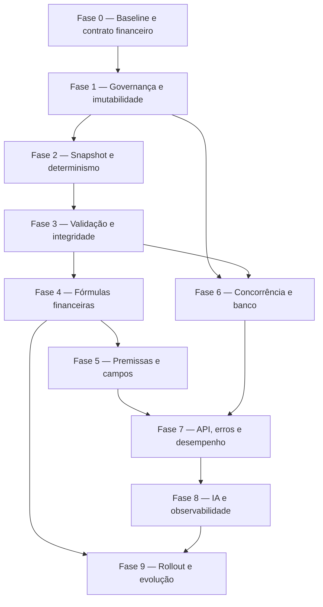

# Plano de Saneamento e Evolução do Sistema de Viabilidade

**Data:** 13 de julho de 2026  
**Status:** parcialmente implementado (2026-07-13) — fases 0–3, 4A, 6–8 estruturais no código; 4B/5/9 e conformidade financeira total da planilha ainda abertas  
**Escopo:** backend tenant, motor `app/Services/Tenant/Viabilidade/v1`, persistência, aprovação, API, IA e testes de conformidade  
**Documentos de referência:**

- `docs/2026-05-03- Motor_calculo_viabilidade.md`
- `docs/2026-06-14-analise-planilha-vs-sistema.md`
- `docs/viabilidade-modelo/Viabilidade LRG - V.01.2026 - Modelo - cópia.xlsx`
- `AGENTS.md`

---

## 1. Objetivo

Tornar o sistema de viabilidade uma fonte auditável e determinística para decisões de aquisição e aprovação de empreendimentos. O trabalho deve corrigir primeiro os riscos capazes de alterar um estudo já submetido ou aprovado, depois reconciliar os cálculos com a planilha oficial e, por último, melhorar desempenho, ergonomia e capacidade analítica.

Ao final, o backend deve garantir que:

1. um estudo submetido ou aprovado não seja alterado silenciosamente;
2. os mesmos dados de entrada sempre produzam o mesmo resultado;
3. cada cálculo indique as entradas, premissas, versão do motor e fórmulas utilizadas;
4. DRE, fluxo de caixa, POC e indicadores sejam reconciliáveis;
5. diferenças contra a planilha oficial falhem o teste, em vez de apenas serem impressas;
6. concorrência não produza versões duplicadas, duas viabilidades atuais ou duas aprovações;
7. a API não exponha resultados gigantes ou detalhes internos sem necessidade;
8. cenários e análises de IA usem apenas dados consistentes e claramente classificados.

---

## 2. Abordagem

Executar o ajuste em dez fases pequenas e reversíveis. As fases 0 a 4 são bloqueadoras para confiar financeiramente no sistema; as fases 5 a 8 fecham consistência operacional, arquitetura e desempenho; a fase 9 controla migração e rollout. Novas capacidades entram somente depois da estabilização.

Mudanças materiais de fórmula não devem sobrescrever resultados históricos. Estudos aprovados permanecem com o resultado persistido e com a versão de cálculo original. O motor corrigido passa a valer para novas versões de estudo.

---

## 3. Escopo

### Incluído

- Máquina de estados de aprovação, bloqueio e revogação.
- Imutabilidade e versionamento de estudos.
- Persistência completa de produtos customizados e premissas.
- Validação dos invariantes de produto e terreno.
- Correções de terreno, curvas, CEF, impostos, POC, dívida PJ, TIR e reconciliação.
- Ciclo de vigência das premissas.
- Integridade e concorrência no banco tenant.
- Contrato da API, cache, paginação, tratamento de erros e desempenho.
- Consistência das tools de IA e da análise preditiva.
- Testes unitários, Feature, arquitetura, conformidade e PostgreSQL.
- Estratégia de migração, comparação e rollout.

### Fora do escopo desta primeira implementação

- Alterar o frontend antes de estabilizar o contrato novo.
- Substituir a planilha oficial sem validação do time financeiro.
- Recalcular automaticamente viabilidades históricas aprovadas.
- Introduzir bibliotecas financeiras ou de simulação antes de validar a necessidade.
- Refatorar módulos não relacionados à viabilidade.
- Implementar as features opcionais da seção 17 junto com os P0.

---

## 4. Diagnóstico resumido e prioridade

| Prioridade | Problema | Risco | Resultado alvo |
|---|---|---|---|
| P0 | Aprovação pode ser reenviada e estudo em aprovação pode ser alterado/recalculado | Bypass de governança e decisão sobre números mutáveis | Máquina de estados explícita e versão imutável |
| P0 | Produtos customizados não ficam no snapshot canônico | Recalcular/consultar pode usar dados diferentes dos informados | Snapshot completo, estável e usado no recálculo |
| P0 | Compra direta do terreno entra em dois componentes do fluxo | Custo e exposição operacional superestimados | Uma única regra de reconhecimento e pagamento |
| P0 | `data_lancamento` não integra todo o contrato e possui fallback baseado em `now()` | Resultado muda conforme a data do recálculo | Data congelada e obrigatória no estudo |
| P0 | `terreno_id` pode mudar na atualização | Versões e workflow ficam ligados ao terreno errado | Terreno imutável após criação |
| P0 | Permutas e produtos não possuem invariantes suficientes | Unidades/custos negativos e receita fantasma | Validação estrutural e de domínio |
| P1 | Curvas longas reutilizam curva de 36 meses e medições finais divergem da planilha | Fluxo mensal, exposição e TIR incorretos | Curvas oficiais normalizadas e testadas |
| P1 | DRE, fluxo, POC, impostos e dívida PJ usam bases diferentes | Indicadores não reconciliáveis | Bases contábeis declaradas e invariantes |
| P1 | Versão e aprovação dependem de `max + 1` sem proteção completa | Corrida de concorrência | Constraints e transações com lock |
| P1 | Vigência de premissas pode criar sobreposição ou lacuna | Cálculo sem premissa válida ou com escolha ambígua | Intervalos de vigência sem sobreposição |
| P1 | Listas retornam payload pesado, cache não é invalidado e existem N+1 | Latência e dados desatualizados | Resources leves, cache coerente e queries limitadas |
| P1 | Erros internos podem chegar ao cliente | Vazamento de implementação e respostas inconsistentes | `DomainException` e envelope único |
| P2 | IA recebe resultados completos e inclui estudos ainda não decididos | Custo de tokens e estatística enviesada | Resumos financeiros e amostra explicitamente filtrada |
| P2 | Há campos aceitos mas sem efeito no motor | Usuário acredita que alterou o cálculo | Implementar, descontinuar ou rejeitar cada campo |

### Baseline observado antes deste plano

Na revisão que originou este documento, as suítes focadas e de arquitetura somaram **75 testes aprovados e 875 asserções**, e o PHPStan nível 8 terminou sem erros. A suíte completa `composer test` não foi executada naquele diagnóstico e deve ser rodada antes do primeiro PR.

O resultado verde ainda não representa conformidade financeira suficiente. O teste da planilha permitia tolerâncias globais amplas e imprimiu, sem falhar, divergências relevantes no cenário LRG, entre elas:

- comissão da planilha em aproximadamente R$ 428 mil contra zero no sistema;
- exposição operacional em aproximadamente R$ -7,2 milhões na planilha contra R$ -1,1 milhão no sistema;
- exposição financeira em aproximadamente R$ -4,8 milhões na planilha contra valor próximo de zero no sistema;
- TIR exibida para inspeção, sem asserção contratual equivalente à planilha.

Esses valores são evidência de que o primeiro trabalho deve ser fortalecer o teste de conformidade, e não ajustar tolerâncias para manter o resultado verde.

---

## 5. Ordem de execução e dependências



Não iniciar a Fase 4 antes de fechar o snapshot da Fase 2. Sem isso, um teste de conformidade pode comparar fórmulas diferentes com entradas diferentes e produzir uma conclusão inválida.

---

## 6. Fase 0 — Congelar baseline e contrato financeiro

### Objetivo

Criar uma referência reproduzível antes de qualquer correção. Esta fase não muda fórmula de produção.

### Arquivos principais

- `tests/Feature/Tenant/PlanilhaConformidadeTest.php`
- `tests/Feature/Tenant/ViabilidadeRealOutputTest.php`
- `tests/Unit/Services/Viabilidade/`
- `docs/viabilidade-modelo/`
- novo diretório de fixtures dentro de `tests/Fixtures/Viabilidade/`, se o padrão atual de testes permitir

### Instruções

1. Selecionar, com o responsável financeiro, de três a cinco estudos de referência:
   - loteamento CEF;
   - incorporação CEF;
   - financiamento próprio;
   - compra direta de terreno;
   - parceria/permuta física e financeira.
2. Exportar para fixture apenas os dados necessários, sem dados pessoais de proprietários ou clientes.
3. Congelar para cada cenário:
   - entradas e premissas;
   - calendário mensal;
   - VGV bruto e líquido;
   - unidades próprias, permutadas e comercializáveis;
   - receitas e despesas mensais por categoria;
   - fluxo operacional e financeiro;
   - DRE gerencial, DRE caixa e POC;
   - exposição máxima, payback e TIR;
   - resultado esperado da planilha oficial.
4. Substituir tolerâncias globais amplas por tolerâncias por métrica. Uma sugestão inicial, sujeita ao financeiro:

| Métrica | Tolerância inicial |
|---|---:|
| Quantidades de unidades | exata |
| Datas e número de períodos | exata |
| Curvas acumuladas | 0,01 ponto percentual |
| VGV e custos contratuais | R$ 0,01 após arredondamento definido |
| Totais financeiros derivados | até 0,10% |
| Fluxo mensal por categoria | até R$ 1,00 ou 0,10%, o maior |
| Margens | 0,05 ponto percentual |
| TIR | 0,10 ponto percentual, após definir XIRR/IRR |

5. Fazer o teste falhar quando uma linha mensal ou indicador ultrapassar a tolerância. A saída diagnóstica pode continuar existindo, mas não pode substituir a asserção.
6. Registrar em cada fixture a versão da planilha, a data de validação e o responsável pela aprovação da regra.

### Critérios de aceite

- O cenário atual pode ser reproduzido localmente sem depender do relógio ou de dados externos.
- Diferença relevante em comissão, exposição ou TIR causa falha real.
- O teste não usa tolerância de 20% para VGV nem 30% para lucro como contrato final.
- A equipe financeira aprova por escrito as bases e a periodicidade da TIR.

---

## 7. Fase 1 — Governança, aprovação e imutabilidade

### Problemas a corrigir

- `ViabilidadeService::solicitarAprovacao()` não restringe adequadamente o estado de origem.
- Atualização é bloqueada somente quando `approval_status` é `aprovada`; um estudo `em_aprovacao` continua mutável.
- `recalcularDre()` aceita estudo aprovado e sobrescreve o resultado que embasou a decisão.
- O estado atual usa strings distribuídas e combina `status`, `approval_status`, `is_current` e `locked_at` sem um único contrato.

### Arquivos principais

- `app/Services/Tenant/Viabilidade/v1/ViabilidadeService.php`
- `app/Models/Tenant/Viabilidade.php`
- `app/Repositories/Tenant/ViabilidadeRepository.php`
- `app/Http/Requests/Tenant/SubmitViabilidadeApprovalRequest.php`
- `app/Http/Requests/Tenant/DecideViabilidadeApprovalRequest.php`
- `app/Http/Requests/Tenant/RevokeViabilidadeApprovalRequest.php`
- `app/Http/Requests/Tenant/RecalculateViabilidadeRequest.php`
- `app/Exceptions/`
- `tests/Feature/Tenant/ViabilidadeApiTest.php`

### Decisão recomendada de estado

Criar um enum nativo para `approval_status`, mantendo string no banco para compatibilidade com SQLite e PostgreSQL.

| Estado atual | Ação | Estado seguinte | Permitido |
|---|---|---|---|
| `pendente` | editar/recalcular | `pendente` | sim |
| `pendente` | submeter | `em_aprovacao` | sim |
| `em_aprovacao` | editar/recalcular | — | não |
| `em_aprovacao` | aprovar | `aprovada` | sim, se não houver outra aprovada |
| `em_aprovacao` | rejeitar | `rejeitada` | sim |
| `rejeitada` | editar/recalcular | — | não na mesma versão |
| `rejeitada` | duplicar | nova versão `pendente` | sim |
| `aprovada` | editar/recalcular/submeter | — | não |
| `aprovada` | revogar | `pendente` ou estado específico `revogada` | somente diretor e sem comitê em andamento |

Preferir um estado explícito `revogada` se o frontend e as métricas puderem ser migrados. Se a compatibilidade exigir retorno para `pendente`, registrar obrigatoriamente a revogação no histórico e exigir nova versão antes de editar.

### Instruções

1. Centralizar transições em um método de domínio ou serviço, por exemplo `transitionApprovalStatus()`, sem espalhar comparações de strings.
2. Criar `DomainException` específica para transição inválida, estudo bloqueado, concorrência e nova submissão indevida.
3. Bloquear atualização e recálculo quando o estado for `em_aprovacao` ou `aprovada`.
4. Alterar recálculo de estudo aprovado para criar uma nova versão `pendente`; nunca sobrescrever `resultados_dre`, `premissas_snapshot` ou indicadores aprovados.
5. Na submissão:
   - validar estado `pendente`;
   - confirmar que existe resultado calculado;
   - confirmar que não há erros de reconciliação;
   - preencher `submitted_at`, `approval_requested_at` e `locked_at` na mesma transação;
   - emitir evento somente após commit.
6. Na decisão:
   - reler a viabilidade com lock;
   - exigir `em_aprovacao`;
   - impedir segunda viabilidade aprovada para o mesmo terreno;
   - persistir ator, data, nota e hash do snapshot aprovado;
   - atualizar workflow dentro de transação coerente.
7. Na revogação:
   - manter a regra de diretor;
   - consultar comitê via repository, não com Eloquent direto no service;
   - gravar motivo obrigatório;
   - preservar o resultado anteriormente aprovado para auditoria.
8. Expor no Resource os campos necessários para o frontend decidir quais ações habilitar, preferencialmente `allowed_actions`, calculados sem query adicional.

### Testes obrigatórios

- Não permite submeter uma viabilidade `aprovada`, `rejeitada` ou `em_aprovacao`.
- Não permite atualizar ou recalcular `em_aprovacao`.
- Não permite atualizar ou recalcular `aprovada`.
- Recálculo solicitado sobre aprovada cria nova versão e preserva a anterior.
- Duas decisões concorrentes não geram duas aprovações.
- Revogação falha quando existe comitê em andamento.
- Eventos não são disparados se a transação falhar.
- Usuários sem permissão recebem 403 antes da execução do service.

### Critérios de aceite

- Um hash do resultado aprovado permanece estável após qualquer ação posterior.
- Não existe caminho HTTP para mudar entradas ou resultados da versão em análise/aprovada.
- Cada transição inválida retorna código de domínio estável e não mensagem interna.

---

## 8. Fase 2 — Snapshot canônico, data e determinismo

### Problemas a corrigir

- `prepararPayloadPersistencia()` calcula `after_form_values`, mas persiste o conjunto anterior em `form_values`.
- `ViabilidadeResource` resolve produtos a partir desse snapshot antigo.
- `recalcularDre()` não repassa os produtos customizados persistidos.
- `data_lancamento` existe no model, mas não integra completamente Request/Resource e possui fallback dinâmico baseado em `Carbon::now()`.
- Uma alteração posterior no cadastro do terreno/produto pode mudar o recálculo de um estudo antigo.

### Arquivos principais

- `app/Services/Tenant/Viabilidade/v1/ViabilidadeService.php`
- `app/Services/Tenant/Viabilidade/v1/ViabilidadeUnificadoService.php`
- `app/Services/Tenant/Viabilidade/v1/PremissasViabilidadeService.php`
- `app/Services/Tenant/Viabilidade/v1/Calculos/ProdutosProcessor.php`
- `app/Http/Requests/Tenant/ViabilidadeRequest.php`
- `app/Http/Resources/Tenant/ViabilidadeResource.php`
- `app/Models/Tenant/Viabilidade.php`

### Contrato recomendado do snapshot

Persistir uma estrutura versionada e autocontida:

```json
{
  "schema_version": 2,
  "calculation_engine_version": "2.0.0",
  "calculated_at": "2026-07-13T12:00:00-03:00",
  "input_hash": "sha256:...",
  "inputs": {
    "terreno_id": 123,
    "data_lancamento": "2028-07-01",
    "perfil_financiamento": "cef",
    "form_values": {},
    "produtos": []
  },
  "premissas": {
    "id": 45,
    "version": 7,
    "values": {}
  },
  "derived": {},
  "warnings": []
}
```

O snapshot não deve guardar models serializados nem campos pessoais. Valores monetários devem seguir uma representação única; manter decimal/string no contrato persistido quando a precisão exigir, convertendo para float apenas na fronteira já adotada pelo motor.

### Instruções

1. Persistir `after_form_values` como `form_values` canônico após atualização.
2. Guardar os produtos efetivamente usados, incluindo valores customizados, em ordem estável por `produto_id`.
3. Fazer `recalcularDre()` ler exclusivamente o snapshot da versão quando ele existir. O cadastro atual do terreno pode ser usado apenas na criação de uma nova versão.
4. Tornar `data_lancamento` obrigatória na criação ou materializar imediatamente o default em uma data fixa persistida. Nunca calcular o default novamente no recálculo.
5. Adicionar `data_lancamento` à validação e ao Resource.
6. Calcular `input_hash` sobre JSON canônico com chaves e produtos ordenados. Excluir timestamps e resultado do hash.
7. Calcular separadamente `result_hash` para auditoria de versões submetidas/aprovadas.
8. Adicionar `schema_version` para permitir leitura dos snapshots legados.
9. Criar um normalizador de snapshot em service/DTO; não implementar parsing complexo dentro do Resource.
10. Não fazer backfill destrutivo. Snapshots legados continuam legíveis como versão 1; novas gravações usam versão 2.

### Testes obrigatórios

- Atualização persiste e retorna os mesmos produtos customizados.
- Alterar o cadastro do produto depois do cálculo não muda o recálculo da mesma versão.
- O mesmo input produz o mesmo `input_hash` independentemente da ordem das chaves.
- Avançar o relógio do teste não muda datas nem resultados.
- Snapshot legado continua sendo serializado sem erro.
- Resource não dispara query para resolver snapshot/premissa.

### Critérios de aceite

- Reexecutar o cálculo com o snapshot gera os mesmos totais e indicadores dentro da tolerância de arredondamento.
- Todas as entradas que afetam fórmula estão presentes ou referenciadas por versão imutável.
- A resposta GET representa exatamente os dados usados no último cálculo daquela versão.

---

## 9. Fase 3 — Validação de domínio e integridade dos produtos

### Problemas a corrigir

- `terreno_id` pode ser trocado durante update.
- Produto customizado não é validado como pertencente ao terreno selecionado.
- IDs de produtos podem ser repetidos.
- `permuta` pode superar `unidades`, produzindo quantidades e custos negativos.
- Caminhos com `max(1, unidades - permutas)` podem criar uma unidade comercializável fantasma.
- `pgto_por_lote` e `permuta` possuem semântica pouco explícita entre quantidade, percentual e valor.

### Arquivos principais

- `app/Http/Requests/Tenant/ViabilidadeRequest.php`
- `app/Services/Tenant/Viabilidade/v1/Calculos/ProdutosProcessor.php`
- `app/Services/Tenant/Viabilidade/v1/Calculos/ReceitasCalculator.php`
- `app/Services/Tenant/Viabilidade/v1/Calculos/FluxoMensalCalculator.php`
- `app/Services/Tenant/Viabilidade/v1/Calculos/DespesasCalculator.php`
- `app/Repositories/Tenant/ViabilidadeRepository.php`

### Instruções

1. Aceitar `terreno_id` somente no store. No update, rejeitar o campo ou exigir que seja idêntico ao original.
2. Validar cada produto em uma única consulta no repository:
   - existe;
   - pertence ao terreno;
   - não está duplicado no payload;
   - possui curva de venda compatível;
   - possui custos exigidos pelo tipo do produto.
3. Definir explicitamente unidades de medida:
   - `unidades`: inteiro;
   - `unidades_permuta`: inteiro entre zero e `unidades`;
   - `pagamento_terrenista_por_unidade`: valor monetário não negativo;
   - percentuais: armazenados em percentual de 0 a 100 na API e normalizados uma única vez no motor.
4. Renomear campos ambíguos somente por evolução compatível de API: aceitar o nome legado por período de transição, retornar aviso de depreciação e documentar o canônico.
5. Remover `max(1, ...)` onde zero é um estado válido. Para produto 100% permutado:
   - receita comercial deve ser zero;
   - custo da parte da incorporadora deve seguir a regra de contrato;
   - o produto continua aparecendo para rastrear a permuta, sem venda fantasma.
6. Rejeitar totais negativos e `NaN`/infinito após o processamento, antes de iniciar o fluxo mensal.
7. Parar de inferir produto de loteamento pelo texto do nome contendo “lote” ou “terreno”. Usar tipo/categoria estruturada do cadastro; se ainda não existir, criar enum e migração específica.
8. Retornar erros de validação por índice do produto, facilitando correção no frontend.

### Testes obrigatórios

- Produto de outro terreno retorna 422.
- Produto duplicado retorna 422.
- Permuta maior que unidades retorna 422.
- Produto 100% permutado gera zero unidade vendável e nenhuma receita fantasma.
- Update com outro terreno retorna 422/409 e não muda versão ou workflow.
- Valores percentuais 0 e 100 funcionam; valores acima de 100 falham.
- Tipo do produto não depende do nome comercial.

---

## 10. Fase 4 — Correções e reconciliação das fórmulas financeiras

Esta fase deve ser implementada em PRs separados por bloco de fórmula. Cada PR começa com teste que reproduz a divergência e termina com validação contra a planilha oficial. Não misturar correção de fórmula com refatoração estética.

### 10.1 Compra direta e custo do terreno — P0

**Problema:** `DespesasCalculator` soma `custoTerreno` e `pagamentoTerreno`; a compra direta pode entrar proporcionalmente à receita e novamente parcelada durante a obra.

**Arquivos:**

- `app/Services/Tenant/Viabilidade/v1/Calculos/DespesasCalculator.php`
- `app/Services/Tenant/Viabilidade/v1/Calculos/DreCalculator.php`
- `app/Services/Tenant/Viabilidade/v1/Calculos/PocCalculator.php`

**Regra recomendada:** separar reconhecimento econômico e desembolso de caixa.

- DRE: reconhecer uma única vez o custo total de aquisição do terreno, conforme regime definido.
- Fluxo de caixa: lançar somente o cronograma real de pagamento.
- Parceria VGV/terrenista: reconhecer e pagar segundo sua própria base, sem reutilizar compra direta.
- Permuta física: refletir unidades/receita cedidas e o custo contratual aplicável sem duplicar VGV e despesa.

**Decisão financeira obrigatória:** confirmar se compra direta segue parcelas mensais, quatro parcelas semestrais da planilha ou cronograma informado pelo usuário. O melhor desenho é aceitar um cronograma explícito e usar o padrão oficial apenas quando ausente.

**Aceite:** a soma dos desembolsos de compra direta é exatamente igual ao contrato; a DRE contém o custo uma única vez; a ponte DRE x caixa explica apenas a diferença temporal.

### 10.2 Curvas de obra e medição CEF — P1

**Problemas:** prazos de 48/60 meses usam a curva mais próxima de 36 meses; existem lacunas artificiais; curvas 18/24 podem superar 100% quando combinadas com obra até lançamento; o saldo final de medição usa divisão 55/45 e meses diferentes da regra da planilha.

**Arquivos:**

- `app/Services/Tenant/Viabilidade/v1/CurvaService.php`
- `app/Services/Tenant/Viabilidade/v1/Calculos/ReceitasCalculator.php`
- `app/Services/Tenant/Viabilidade/v1/Calculos/DespesasCalculator.php`

**Instruções:**

1. Importar as curvas oficiais da aba auxiliar da planilha como fixtures/tabelas versionadas.
2. Definir comportamento para prazos não tabelados: interpolação monotônica ou redistribuição por percentil; não escolher silenciosamente a curva mais próxima.
3. Garantir soma de 100% separadamente para a curva física e para a curva financeira de medição.
4. Definir uma única função para curva física e uma transformação explícita para curva financeira.
5. Implementar a regra oficial das medições finais, incluindo percentuais e meses exatos.
6. Validar monotonicidade do acumulado e ausência de meses vazios não previstos.
7. Retornar warning quando o prazo solicitado não possuir curva oficial e precisar de interpolação.

**Aceite:** cada curva soma 100,00%; o acumulado nunca diminui; 48/60 meses não usam vetor de 36 meses; datas e valores das medições finais coincidem com a planilha.

### 10.3 Demanda mínima CEF — P1

**Problema:** o percentual de demanda de cada produto é aplicado ao total de unidades do projeto e somado, inflando a barreira quando há vários produtos.

**Arquivo:** `app/Services/Tenant/Viabilidade/v1/Calculos/FluxoMensalCalculator.php`.

**Regra:** calcular `sum(unidades_comercializaveis_produto × demanda_produto)`; se a regra contratual for por VGV, usar `sum(VGV_financiável_produto × demanda_produto) / ticket_médio` de forma documentada. Não misturar as duas bases.

**Aceite:** dois produtos com 30% de demanda resultam em 30% ponderado do total, e não 60%.

### 10.4 POC e base de custo — P1

**Problema:** o denominador usa habitação + infraestrutura, enquanto o custo mensal extraído como “Obra” pode incluir não incidente, canteiro e seguros; custo pré-lançamento pode ficar fora do numerador.

**Arquivo:** `app/Services/Tenant/Viabilidade/v1/Calculos/PocCalculator.php`.

**Instruções:**

1. Definir `custo_orcado_poc` em uma função única.
2. Classificar cada linha de despesa como incluída ou excluída do POC.
3. Somar no realizado exatamente as mesmas categorias do orçamento.
4. Incluir obra pré-lançamento quando fizer parte da base orçada.
5. Limitar POC a [0, 1], mas falhar/informar warning se o custo realizado ultrapassar o orçamento; não esconder a diferença apenas com `min(1)`.

**Aceite:** POC chega a 100% somente quando toda a base de custo correspondente foi incorrida; a receita reconhecida acumulada reconcilia com a receita contratada.

### 10.5 Impostos e base de VGV — P1

**Problema:** proporções por produto podem usar VGV bruto no numerador e VGV líquido no denominador, fazendo a alocação ultrapassar 100% quando há permuta/terrenista.

**Arquivos:**

- `app/Services/Tenant/Viabilidade/v1/ImpostosService.php`
- `app/Services/Tenant/Viabilidade/v1/Calculos/DreCalculator.php`

**Regra:** declarar para cada imposto a base legal/gerencial: VGV bruto, receita líquida de permuta, receita recebida ou receita reconhecida. Numerador e denominador da alocação devem usar a mesma base.

**Aceite:** proporções por produto somam 100% ou zero quando não há base; imposto consolidado é igual à soma por produto.

### 10.6 Dívida PJ e fluxo financeiro — P1

**Problema:** a DRE calcula juros sobre obra, carência e amortização; o fluxo financeiro paga juros apenas durante a amortização e pode terminar antes de quitar o saldo.

**Arquivos:**

- `app/Services/Tenant/Viabilidade/v1/ImpostosService.php`
- `app/Services/Tenant/Viabilidade/v1/Calculos/IndicadoresCalculator.php`
- `app/Services/Tenant/Viabilidade/v1/Calculos/FluxoMensalCalculator.php`

**Instruções:**

1. Gerar um cronograma único da dívida com saldo inicial, desembolso, juros, carência, amortização e saldo final.
2. Usar o mesmo cronograma na DRE e no fluxo financeiro.
3. Estender o horizonte até a quitação ou lançar balloon final explicitamente.
4. Definir se juros na carência são pagos ou capitalizados.
5. Validar que saldo final seja zero dentro de R$ 0,01.

**Aceite:** soma de principal amortizado = principal recebido; juros da DRE = juros do cronograma; não existe dívida desaparecendo no fim do horizonte.

### 10.7 TIR, datas e vetor financeiro — P1

**Problema original:** o cálculo usava IRR mensal por posição, ignorava datas reais e não separava o fluxo do projeto do fluxo de tesouraria/distribuição.

**Arquivo:** `app/Services/Tenant/Viabilidade/v1/Calculos/IndicadoresCalculator.php`.

**Decisões adotadas no motor 2.3.0:**

| Indicador | Vetor proposto |
|---|---|
| TIR operacional | saldos operacionais acumulados, conforme `Tab_Mestre!ID` |
| TIR financeira | saldos acumulados após funding e serviço da dívida PJ, conforme `Tab_Mestre!IU` |
| TIR sem CEF | saldos acumulados do cenário explicitamente recalculado sem funding CEF |

Usar sempre XIRR com os dias reais entre as datas, inclusive em séries mensais. Fluxos não convencionais usam a única raiz não negativa; múltiplas raízes não negativas resultam em `null` por ambiguidade.

**Aceite:** datas alteram XIRR de modo previsível; vetor sem mudança de sinal ou com múltiplas raízes não negativas retorna `null`; distribuição não altera TIR financeira; o caso canônico reproduz 600,53% operacional e 991,81% financeira dentro de 0,10 p.p.

### 10.8 DRE, caixa e reconciliação — P1

**Problema:** a DRE consolidada é calculada de forma independente do fluxo mensal. A ponte atual não garante identidades suficientes para detectar categorias ausentes ou duplicadas.

**Arquivos:**

- `app/Services/Tenant/Viabilidade/v1/Calculos/DreCalculator.php`
- `app/Services/Tenant/Viabilidade/v1/Calculos/PocCalculator.php`
- `app/Services/Tenant/Viabilidade/v1/Calculos/FluxoMensalCalculator.php`

**Invariantes obrigatórios:**

```text
receita_caixa_total = soma(receitas_mensais)
despesa_caixa_total = soma(despesas_mensais)
saldo_final = receita_caixa_total - despesa_caixa_total
lucro_dre = receita_reconhecida - custos_reconhecidos - despesas - impostos - financeiro
receita_poc_acumulada_final = receita_contratada_elegivel
custo_poc_acumulado_final = custo_orcado_poc, salvo estouro explicitamente reportado
saldo_divida_final = 0
unidades_vendidas + estoque_final + permutas = unidades_totais
```

Adicionar uma seção `reconciliation` ao resultado com `status`, diferenças, tolerâncias e warnings. Submissão para aprovação deve falhar se um invariante crítico não fechar.

---

## 11. Fase 5 — Premissas, vigência e campos sem efeito

### 11.1 Ciclo de vigência das premissas

**Problemas:** criação pode deixar múltiplas premissas concorrentes; atualização fecha a anterior imediatamente mesmo quando a nova começa no futuro; empates de vigência podem ser não determinísticos.

**Arquivos:**

- `app/Services/Tenant/PremissasViabilidadeCrudService.php`
- `app/Services/Tenant/Viabilidade/v1/PremissasViabilidadeService.php`
- `app/Repositories/PremissasViabilidadeRepository.php`
- `app/Models/Tenant/PremissasViabilidade.php`
- `app/Http/Controllers/Api/V1/Tenant/PremissasViabilidadeController.php`
- `app/Http/Requests/Tenant/StorePremissasViabilidadeRequest.php`
- `app/Http/Requests/Tenant/UpdatePremissasViabilidadeRequest.php`

**Regra recomendada:** vigência é definida por intervalo `[vigente_em, vigente_ate]`; intervalos ativos do mesmo perfil não podem se sobrepor. É permitido agendar uma premissa futura, mantendo a atual válida até a véspera. A seleção ordena por `vigente_em`, depois `version` e `id` de forma determinística.

**Instruções:**

1. Mover todas as queries para repository.
2. Criar FormRequest também para destroy.
3. Ao agendar uma nova premissa, ajustar `vigente_ate` da anterior para a véspera, sem torná-la inativa antes da hora.
4. Impedir lacuna quando o perfil exige premissa obrigatória, ou definir fallback versionado explícito.
5. Impedir exclusão de premissa referenciada por snapshot; permitir apenas inativação.
6. Criar constraint/validação de versão e teste de intervalos sobrepostos.

### 11.2 Inventário dos campos aceitos

Classificar todo campo de Request/Model/Premissa em uma matriz gerada e revisada:

| Classificação | Ação |
|---|---|
| Usado e testado | manter e documentar fórmula |
| Usado sem teste | adicionar teste de sensibilidade |
| Montado mas ignorado | implementar ou rejeitar no Request |
| Legado | marcar depreciação, manter leitura temporária e remover em versão de API futura |

Campos já identificados para decisão:

- `meses_entrega`;
- `variavel_correcao`;
- `despesas_onerosas_bancos`;
- `distribuicao_lucros_percentual_obra`;
- `obra_ate_lancamento` no desembolso físico pré-lançamento.

Para cada campo mantido, criar teste de sensibilidade: alterar apenas o campo deve mudar exatamente a linha/indicador esperado. Se o campo não tiver efeito de negócio validado, a API deve rejeitá-lo ou deixar de expô-lo; não manter controles inertes.

### Critérios de aceite

- Sempre existe exatamente uma premissa aplicável por perfil e data, ou um erro de domínio claro.
- Premissa futura não invalida a vigente hoje.
- Nenhum campo público permanece aceito sem uso documentado e teste de sensibilidade.

---

## 12. Fase 6 — Integridade transacional e concorrência

### Problemas

- Versão usa `max(version) + 1`.
- Índice de `(terreno_id, version)` não é necessariamente único.
- `is_current` e aprovação única dependem apenas de check-before-update.
- Duas requisições podem decidir ou criar versão simultaneamente.

### Arquivos principais

- `app/Repositories/Tenant/ViabilidadeRepository.php`
- `app/Services/Tenant/Viabilidade/v1/ViabilidadeService.php`
- nova migration em `database/migrations/tenant/`
- `app/Support/Database/`, caso seja necessário abstrair índice parcial por driver

### Instruções

1. Criar migration nova; nunca editar migrations aplicadas.
2. Antes de adicionar constraints, criar comando ou script de auditoria para localizar:
   - versões duplicadas por terreno;
   - mais de uma `is_current`;
   - mais de uma `aprovada`;
   - versões sem snapshot/resultados.
3. Definir correção manual/assistida para dados inconsistentes; não escolher automaticamente qual aprovação deve prevalecer.
4. Adicionar unique index em `(terreno_id, version)`.
5. Garantir uma viabilidade atual e uma aprovada por terreno. Opções aceitáveis:
   - índices únicos parciais em PostgreSQL e SQLite, encapsulados conforme o padrão `app/Support/Database/`; ou
   - colunas-slot nullable com unique composto, se o time preferir portabilidade via Schema Builder.
6. Envolver criação, duplicação, ativação, submissão, decisão e revogação em transações.
7. Adquirir lock na linha do terreno ou no conjunto de viabilidades antes de calcular a próxima versão/decidir.
8. Tratar violação de unique como conflito 409 de domínio, nunca como 500.
9. Adicionar teste de integração em PostgreSQL para concorrência; SQLite `:memory:` não comprova comportamento de lock.
10. Implementar `down()` funcional para todos os índices/colunas novos.

### Critérios de aceite

- Duas criações simultâneas recebem versões diferentes ou uma retorna 409 controlado.
- O banco impede duas versões iguais, duas atuais ou duas aprovadas.
- Testes passam em SQLite e há validação específica em PostgreSQL.

---

## 13. Fase 7 — Contrato da API, erros, cache e desempenho

### 13.1 Resources e tamanho de payload

**Problema:** listagens podem incluir `resultados_dre` e fluxo mensal completos; `ViabilidadeCalculationResource` pode duplicar estruturas e enfraquecer o controle de `include`.

**Arquivos:**

- `app/Http/Resources/Tenant/ViabilidadeResource.php`
- `app/Http/Resources/Tenant/ViabilidadeCalculationResource.php`
- `app/Http/Controllers/Api/V1/Tenant/ViabilidadeController.php`
- `app/Repositories/Tenant/ViabilidadeRepository.php`

**Contrato recomendado:**

- Listagem: identificação, terreno, versão, status, datas e KPIs resumidos.
- Detalhe: entradas e DRE resumida.
- `include=monthly_cash_flow`: fluxo mensal completo somente sob demanda.
- Endpoint dedicado/export assíncrono para payload extenso, se ultrapassar o tempo de request.

Adicionar limite/paginação em `forSelect`; nunca retornar lista ilimitada de uma tabela crescente.

### 13.2 Cache

1. Mapear todas as chaves/tags da viabilidade.
2. Invalidar após create, update, duplicate, recalculate, submit, decide, revoke, restore e delete.
3. Invalidar somente o tenant atual.
4. Cobrir com teste que lê, muta e lê novamente sem receber dado antigo.

### 13.3 Queries e arquitetura

1. Remover reconsulta de produtos em `ProdutosProcessor` quando o agregado já foi eager-loaded.
2. Evitar query por produto; carregar o conjunto em uma consulta.
3. Mover Eloquent direto de `ViabilidadeUnificadoService`, revogação e Resources para repositories/services apropriados.
4. Adicionar os arquivos ao conjunto controlado dos testes de arquitetura, sem enfraquecer as regras existentes.
5. Usar `select()` explícito nas listagens e evitar carregar JSON de resultado quando não solicitado.

### 13.4 Erros e segurança

1. Não capturar `AuthorizationException` como erro genérico; deixar o handler global produzir 403.
2. Substituir `catch (Exception)` com retorno 422 por exceções de domínio específicas.
3. Nunca retornar `$e->getMessage()` de erro interno em gerar DRE/PDF/export.
4. Usar sempre `ApiResponseService` ou Resource, mantendo o envelope oficial.
5. Remover log do resultado financeiro completo; registrar IDs, duração, versão do motor, hashes, warnings e métricas agregadas.
6. Mover qualquer `env()` de controller/service para `config/`.
7. Tornar PDF/export pesado assíncrono se a medição real se aproximar do timeout de 120 segundos.

### Critérios de aceite

- Listagem não carrega nem serializa fluxo mensal.
- `forSelect` possui limite/paginação.
- Mutação invalida cache no mesmo request.
- Respostas de produção não contêm nome de classe, SQL, stack trace ou mensagem interna.
- Teste de query count comprova ausência de N+1 no cálculo com múltiplos produtos.

---

## 14. Fase 8 — IA, análise preditiva e observabilidade

### IA

**Problemas:** `GetViabilidadesTool` pode enviar `resultados_dre` completos para o provider; análise preditiva inclui estados pendentes em métricas que parecem representar decisões.

**Arquivos:**

- `app/Services/Ai/Tools/GetViabilidadesTool.php`
- `app/Repositories/AiPredictiveRepository.php`
- `app/Services/Ai/Tools/AiPredictiveAnalysisService.php`

**Instruções:**

1. Criar projeção resumida para IA: status, VGV, margem, TIR, exposição, payback, principais warnings e versão do motor.
2. Limitar quantidade, período e campos antes da redação/envio ao provider.
3. Separar conjuntos:
   - decididas: somente `aprovada` e `rejeitada`;
   - em análise: `pendente` e `em_aprovacao`;
   - revogadas: conjunto próprio, se o estado for criado.
4. Calcular taxa de aprovação e confiança sobre a mesma população.
5. Incluir tamanho da amostra, período e distribuição de status em toda resposta preditiva.
6. Não usar viabilidades de versões antigas e atuais simultaneamente sem deduplicação por terreno.
7. Aplicar redator existente e registrar telemetria sem snapshot financeiro bruto.

### Observabilidade do motor

Registrar, sem dados pessoais:

- tenant e viabilidade por identificador técnico permitido;
- versão do motor e schema do snapshot;
- duração total e por calculadora;
- quantidade de meses/produtos;
- warnings e invariantes quebrados;
- input/result hash;
- status do cálculo.

Criar alertas para:

- resultado não finito;
- reconciliação acima da tolerância;
- curva diferente de 100%;
- saldo de dívida diferente de zero;
- cálculo lento;
- tentativa de mutação de versão bloqueada.

### Critérios de aceite

- Tool de IA não recebe fluxo mensal completo por padrão.
- Métrica chamada “taxa de aprovação” usa somente decisões finais.
- Logs permitem diagnosticar cálculo sem expor todo o conteúdo financeiro.

---

## 15. Fase 9 — Compatibilidade, migração e rollout

### Princípios

- Resultados aprovados são registros históricos, não cache descartável.
- Mudança material de fórmula exige versão identificável do motor.
- Não recalcular em massa sem relatório de impacto e autorização de negócio.
- Primeiro comparar, depois ativar.

### Estratégia recomendada

1. Adicionar metadados `calculation_engine_version`, `snapshot_schema_version`, `input_hash` e `result_hash` em migration tenant ou dentro do snapshot, definindo quais precisam de índice/consulta.
2. Marcar registros existentes como versão legada sem alterar seus números.
3. Implementar leitura compatível dos snapshots legados.
4. Executar o motor corrigido em modo sombra para uma amostra representativa, sem persistir como resultado oficial.
5. Gerar relatório por estudo com:
   - diferença de VGV;
   - lucro/margem;
   - exposição operacional e financeira;
   - TIR/payback;
   - categorias que explicam a diferença.
6. Fazer aprovação financeira das diferenças esperadas.
7. Ativar o motor corrigido somente para novas viabilidades/novas versões.
8. Permitir duplicar estudo legado para a versão nova, exibindo comparação antes/depois.
9. Monitorar erros, tempo e reconciliação por tenant no período inicial.
10. Remover compatibilidade antiga somente depois de não existirem consumidores e com versão de API/documentação apropriada.

### Plano de rollback

- Desativar a criação com o motor novo por configuração de aplicação, mantendo leitura dos resultados já gerados.
- Não apagar snapshots/resultados novos durante rollback.
- Reverter apenas a seleção do motor para novas versões.
- Migrations devem ter `down()` funcional, mas rollback de schema com dados deve ser tratado como operação de release controlada.

### Critérios de aceite

- Toda resposta identifica a versão do cálculo.
- Estudos históricos aprovados mantêm os hashes e números originais.
- Existe relatório de comparação e aceite financeiro antes da ativação geral.

---

## 16. Checklist atômico de implementação

- [x] **Fase 0:** criar fixtures financeiras, endurecer `PlanilhaConformidadeTest` e aprovar tolerâncias. *(tolerâncias interim + targets documentados; aceite financeiro formal pendente)*
- [x] **Fase 1:** implementar enum/máquina de estados, bloqueios e nova versão para recálculo de estudo decidido.
- [x] **Fase 2:** persistir snapshot canônico completo, congelar `data_lancamento` e adicionar hashes/versionamento.
- [x] **Fase 3:** tornar terreno imutável e validar propriedade, duplicidade, permuta, unidades e tipo dos produtos. *(tipo estruturado de produto ainda sem enum dedicado)*
- [x] **Fase 4A:** corrigir compra direta/custo do terreno e adicionar reconciliação DRE x caixa. *(compra direta mensal durante a obra; reconciliação com saldo dívida/curva)*
- [x] **Fase 4B:** substituir curvas, demanda CEF, POC, impostos, dívida PJ e TIR por regras validadas. *(curvas Aux_Obras 12–36 + redistribuição 48/60; medição com retenção após 95% e liberações 55%/45%; demanda ponderada; POC base única; alocação fiscal na mesma base; cronograma PJ com saldo 0 e desembolso na demanda; XIRR sobre saldos acumulados operacional/PJ)*
- [x] **Fase 5:** corrigir vigência de premissas e eliminar campos públicos sem efeito. *(intervalos sem sobreposição; futura não invalida vigente; destroy referenciado vira inativação; meses_entrega/distribuicao_lucros/obra_ate_lancamento/variavel_correcao com efeito; despesas_onerosas permanece saída de juros PJ)*
- [x] **Fase 6:** adicionar constraints, locks, transações e testes PostgreSQL de concorrência. *(unique/locks/SQLite parciais; teste PG de concorrência real ainda pendente)*
- [x] **Fases 7–8:** reduzir payloads, corrigir cache/queries/erros e limitar dados enviados à IA. *(DomainException rethrow, forSelect limitado, tool IA com resumo; listagem leve completa ainda pendente)*
- [ ] **Fase 9:** executar comparação sombra, obter aceite financeiro e liberar o motor corrigido para novas versões.

Cada checkbox deve resultar em PR separado ou em uma sequência pequena de PRs, sempre com teste de regressão que falha antes da correção.

---

## 17. Novas funcionalidades recomendadas após o saneamento

Estas funcionalidades não devem bloquear os P0/P1.

### 17.1 Análise de sensibilidade

Gerar matriz/tornado para preço, velocidade de venda, custo de obra, prazo, juros e compra do terreno. Mostrar impacto em margem, TIR e exposição. Reutilizar `ViabilidadeScenarioService` e o motor oficial; não duplicar fórmulas.

### 17.2 Ponto de equilíbrio

Calcular automaticamente:

- preço mínimo por unidade;
- VSO mínimo;
- custo máximo de terreno;
- custo máximo de obra;
- atraso máximo antes de a TIR cair abaixo da meta.

### 17.3 Cenários probabilísticos

Após validar cenários determinísticos, permitir simulação Monte Carlo com distribuições aprovadas. Retornar P10/P50/P90 de margem, TIR e exposição, além da probabilidade de caixa negativo acima do limite.

### 17.4 Explicabilidade do resultado

Para cada linha da DRE/fluxo, expor:

- fórmula legível;
- base utilizada;
- premissa de origem;
- meses afetados;
- versão do motor;
- warning quando houver interpolação ou fallback.

### 17.5 Diff de aprovação

Ao duplicar/revisar um estudo, mostrar diferenças de entradas e resultados contra a versão aprovada: preço, unidades, curva, terreno, custos, margem, TIR e exposição. Exigir justificativa para variações acima de limite configurado.

### 17.6 Cronograma contratual do terreno

Permitir cadastrar parcelas com data/índice/condição, suportando compra direta, parceria, balões e permuta. Gerar também o fluxo do terrenista, hoje ausente na comparação com a planilha.

### 17.7 Biblioteca regional de custos e limites

Versionar custos por regional, tipologia e data, incluindo limites MCMV/CEF aplicáveis. Toda sugestão deve registrar fonte e vigência e nunca sobrescrever automaticamente a premissa do estudo.

### 17.8 Alertas e score de qualidade do estudo

Pontuar completude e consistência antes da submissão:

- campos herdados/default sem confirmação;
- curva interpolada;
- exposição acima do limite;
- POC/cash não reconciliado;
- dívida não quitada;
- preço/custo fora do benchmark;
- premissa expirada.

---

## 18. Matriz mínima de testes

| Camada | Cobertura mínima |
|---|---|
| Unit — calculators | fórmula nominal, zero, limite, 100% permuta, múltiplos produtos, arredondamento |
| Unit — services | transições, snapshot, vigência, hashes e exceções de domínio |
| Feature — API | happy path, 401, 403, 409, 422, bloqueio de aprovado/em aprovação |
| Feature — conformidade | totais e linhas mensais contra fixtures oficiais |
| Architecture | Controller → Service → Repository, FormRequests reais, sem Eloquent em Resources/services controlados |
| PostgreSQL integration | índices parciais/unique, locks e concorrência |
| Performance | query count por produto, tamanho de payload e tempo do cálculo |
| IA | filtros de status, limite de campos/tokens e redação de dados |

Casos financeiros obrigatórios:

1. compra direta sem permuta;
2. parceria VGV;
3. permuta física parcial;
4. produto 100% permutado;
5. um e vários produtos CEF;
6. perfil próprio com inadimplência;
7. prazos de obra 18, 24, 36, 48 e 60 meses;
8. financiamento PJ com carência e amortização além do pós-obra;
9. premissa atual, futura e expirada;
10. estudo legado e estudo no schema novo de snapshot.

---

## 19. Comandos de validação por PR

Executar os testes focados durante o desenvolvimento:

```bash
php artisan test tests/Unit/Services/Viabilidade
php artisan test tests/Unit/Services/Tenant/PremissasViabilidadeCrudServiceTest.php
php artisan test tests/Feature/Tenant/ViabilidadeApiTest.php
php artisan test tests/Feature/Tenant/PremissasViabilidadeApiTest.php
php artisan test tests/Feature/Tenant/PlanilhaConformidadeTest.php
php artisan test tests/Feature/Tenant/ViabilidadeRealOutputTest.php
php artisan test tests/Feature/Tenant/ViabilidadeScenarioApiTest.php
```

Antes do merge de cada fase:

```bash
php artisan test --testsuite=Architecture
composer analyse
./vendor/bin/pint --test
composer test
```

Para mudanças de constraint/lock, adicionar execução documentada contra PostgreSQL. O resultado em SQLite não substitui essa validação.

---

## 20. Definição de pronto

Uma fase só está pronta quando:

- o problema foi reproduzido por teste antes da correção;
- a implementação segue Controller → Service → Repository;
- entradas e saídas públicas estão documentadas;
- mensagens novas existem em `pt-br` e `en-us`;
- migrations novas possuem `down()` funcional e foram testadas em tenant novo e existente;
- snapshots/resultados históricos não foram alterados indevidamente;
- testes focados, arquitetura, PHPStan nível 8, Pint e suite completa passam;
- divergências financeiras foram aprovadas pelo responsável de negócio;
- `AGENTS.md` foi atualizado se a implementação mudou arquitetura, fluxo, API, migrations, IA ou regras permanentes do módulo.

---

## 21. Questões de negócio que precisam de decisão formal

Estas decisões não devem ser inferidas pelo desenvolvedor durante a implementação:

1. Qual é o cronograma padrão da compra direta do terreno: mensal, quatro parcelas semestrais ou sempre informado pelo usuário?
2. Qual é a regra oficial das duas medições finais da CEF: percentuais e meses exatos?
3. **Resolvida no motor 2.3.0:** XIRR sempre usa dias reais; os vetores são os saldos acumulados operacional e após a dívida PJ, conforme `Tab_Mestre!ID/IU`.
4. Quais categorias entram na base de custo do POC?
5. Juros PJ durante obra/carência são pagos ou capitalizados?
6. `permuta` representa unidades, percentual ou valor em cada tela/endpoint legado?
7. Qual base tributária vale para cada imposto em cenários com permuta e terrenista?
8. `meses_entrega`, `variavel_correcao`, `despesas_onerosas_bancos` e `distribuicao_lucros_percentual_obra` devem ser implementados ou removidos?
9. Revogação deve criar estado `revogada` ou retornar a `pendente` exigindo duplicação?
10. Qual tolerância financeira autoriza submissão quando a reconciliação não fecha em centavos?

Registrar as respostas em documentação de decisão arquitetural/financeira antes da Fase 4.
