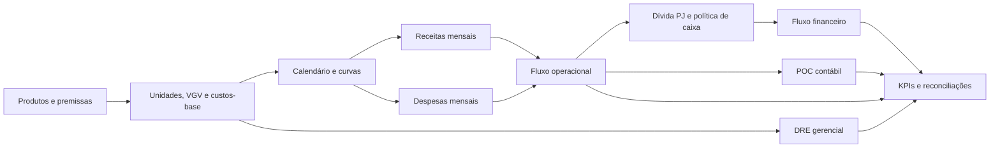

# Guia completo dos cálculos de viabilidade

> Documento funcional e técnico para orientar a página do frontend “Como funciona a viabilidade”.
>
> **Motor documentado:** `2.4.0`  
> **Referência validada:** planilha Cimcal v.02.2026 — Osvaldo Cruz  
> **Atualizado em:** 16/07/2026  
> **Fonte da verdade:** cálculo executado no backend. O frontend deve apresentar os resultados, nunca recalculá-los.

## 1. Objetivo deste documento

Este guia explica como o sistema transforma produtos e premissas de um empreendimento em:

- DRE gerencial do projeto;
- fluxo de caixa operacional mensal;
- fluxo financeiro com dívida PJ, aportes, devoluções e distribuição de lucros;
- DRE caixa;
- DRE contábil por POC;
- indicadores de margem, retorno, exposição, payback, vendas e dívida;
- reconciliações e alertas de integridade.

O texto possui dois níveis de leitura:

1. **Explicação ao usuário:** o significado econômico de cada visão e indicador.
2. **Contrato para a IA do frontend:** fórmulas, campos da API, formatação e cuidados de implementação.

## 2. Instruções obrigatórias para a IA do frontend

Ao criar a página, siga estas regras:

1. Não replique fórmulas no navegador. Consuma os valores calculados e persistidos pelo backend.
2. Não apresente DRE, fluxo operacional, fluxo financeiro e POC como se fossem a mesma visão.
3. Mostre valores monetários em BRL, percentuais com `%` e prazos em meses.
4. Preserve `null` em indicadores como TIR e payback. `null` significa “não calculável”, não zero.
5. Informe que todo resultado depende das premissas cadastradas, das curvas e do calendário do estudo.
6. Use os nomes amigáveis deste documento nos textos e tooltips; use os caminhos da API somente na implementação.
7. Solicite os blocos detalhados com `include` quando a tela precisar deles. A resposta padrão é resumida.
8. Não apresente `aporte_adicional_mensal` nem `devolucao_aporte_percentual` como fórmulas ativas. Esses campos ainda existem no contrato de cadastro, mas o motor oficial `2.4.0` segue automaticamente a política de caixa da planilha: aporte do déficit e devolução de 25% ao mês, limitada ao total aportado.
9. Exiba uma observação de versão: o conteúdo desta página descreve o motor `2.4.0`.
10. Na página de um cálculo real, trate alertas e falhas de reconciliação como informação relevante, não como detalhe técnico descartável.

## 3. Resumo em linguagem simples

A viabilidade responde a quatro perguntas diferentes:

| Visão | Pergunta respondida |
|---|---|
| DRE gerencial | O empreendimento gera lucro econômico depois de impostos, custos, despesas e juros? |
| Fluxo operacional | Em quais meses o dinheiro entra e sai? Quanto caixa o projeto consome antes de se pagar? |
| Fluxo financeiro | Como financiamento PJ, aportes, devoluções e distribuições alteram o caixa do investidor? |
| POC contábil | Quanto da receita e do resultado pode ser reconhecido conforme o avanço da obra? |

Uma viabilidade pode apresentar lucro na DRE e, ao mesmo tempo, exigir caixa elevado nos primeiros meses. Isso não é contradição: lucro mede resultado econômico; fluxo mede o momento dos recebimentos e pagamentos.



## 4. Convenções de cálculo

### 4.1 Valores e sinais

- Receitas e despesas são armazenadas como valores positivos em seus respectivos blocos.
- O saldo mensal é `receitas - despesas`.
- Exposição aparece como saldo negativo.
- Os cálculos internos preservam precisão; os valores apresentados são normalmente arredondados para duas casas decimais.
- Pequenas diferenças de centavos podem surgir pelo rateio mensal.

### 4.2 Percentuais

Os formulários geralmente recebem percentuais em escala humana, como `5` para 5%. O serviço converte esses valores para razão decimal, como `0,05`, antes do cálculo.

Exceção importante: `gastos_mensais_stand` já representa uma razão decimal. Assim:

```text
0,0001 = 0,01% do VGV por mês
```

### 4.3 Datas

Todos os eventos são agrupados por mês, usando a chave `AAAA-MM`. A TIR usa as datas reais desses meses e a quantidade efetiva de dias entre elas.

### 4.4 Perfis de financiamento

O motor possui dois perfis:

- **CEF:** combina recursos próprios do cliente, recurso terreno, medições de obra e dívida PJ.
- **Próprio:** usa sinal, mensalidades, balões e saldo de entrega conforme a configuração do produto.

## 5. Produtos, unidades e valores-base

Para cada produto `p`:

```text
unidades_comercializáveis_p = max(0, unidades_p - permutas_p)
VGV_bruto_p                 = preço_p × unidades_p
VGV_sem_permutas_p          = preço_p × unidades_comercializáveis_p
valor_terrenista_p          = unidades_p × pagamento_por_lote_p
VGV_líquido_terrenista_p    = max(0, VGV_sem_permutas_p - valor_terrenista_p)
área_construída_p           = área_privativa_p × unidades_p
custo_habitação_p           = custo_m²_p × área_privativa_p × unidades_comercializáveis_p
custo_infra_p               = custo_infra_unitário_p × unidades_comercializáveis_p
```

Os totais do empreendimento são a soma dos produtos:

```text
VGV bruto                  = Σ VGV_bruto_p
VGV sem permutas           = Σ VGV_sem_permutas_p
VGV líquido do terrenista  = Σ VGV_líquido_terrenista_p
unidades totais            = Σ unidades_p
unidades de permuta        = Σ permutas_p
unidades comercializáveis  = Σ unidades_comercializáveis_p
```

O campo público `resumo.vgv` representa o **VGV líquido do terrenista**, e não o VGV bruto.

### 5.1 Permuta física

As unidades de permuta:

- não entram nas unidades comercializáveis;
- não geram receita de venda para a incorporadora;
- geram custo de construção tratado como custo do terreno;
- são limitadas ao total de unidades do produto.

```text
custo_permuta_física_p = permutas_p × (custo_m²_p × área_privativa_p + custo_infra_unitário_p)
```

### 5.2 Infraestrutura não incidente

```text
infra_não_incidente = percentual_infra_não_incidente × VGV_bruto
```

Ela integra a base de obra e de assistência técnica usada no fluxo.

## 6. Calendário do empreendimento

A data informada no estudo é a data de lançamento. O motor cria as fases abaixo:

```text
início da incorporação = lançamento - meses de incorporação
fim do lançamento      = lançamento + meses de lançamento - 1 mês
início da obra         = fim do lançamento + 1 mês
fim da obra            = início da obra + meses de obra - 1 mês
entrega                = fim da obra + meses de entrega
início do pós-obra     = mês da entrega
fim do pós-obra        = início do pós-obra + meses de pós-obra - 1 mês
```

Os rótulos mensais são:

1. Incorporação;
2. Lançamento;
3. Obra;
4. Entrega;
5. Pós-Obra.

`meses_entrega` possui mínimo de um mês. O mês de entrega também é o primeiro mês do pós-obra para fins de horizonte, mas recebe o rótulo específico **Entrega**.

## 7. Curvas

### 7.1 Curva de vendas

A curva de vendas de cada produto informa o percentual das unidades comercializáveis vendido em cada mês após o lançamento.

```text
unidades_vendidas_teóricas_p,m = unidades_comercializáveis_p × curva_vendas_p,m / 100
```

A curva é normalizada para somar 100%. O cálculo financeiro preserva unidades fracionárias, porque custos e recebimentos podem ser proporcionais. No campo mensal exibido ao usuário, as frações são carregadas para os meses seguintes para formar unidades inteiras sem perder estoque.

### 7.2 Curva física de obra

O motor usa as curvas oficiais da aba `Aux_Obras` da planilha para prazos de 12 a 36 meses. A curva final soma 100%.

Para prazos fora da tabela, a forma acumulada é interpolada e redistribuída de maneira monotônica. O cálculo gera um alerta informando que não foi usada uma curva tabelada.

### 7.3 Obra executada antes do início da fase Obra

`obra_ate_lancamento` separa o desembolso em duas partes:

```text
obra_no_lançamento = base_de_obra × obra_ate_lancamento
obra_após_lançamento = base_de_obra × (1 - obra_ate_lancamento)
```

A curva física posterior incide somente sobre o saldo remanescente. Isso evita executar mais de 100% do orçamento.

### 7.4 Curva financeira de medição CEF

A curva de medição não é idêntica à curva física:

1. mantém os percentuais mensais enquanto o acumulado físico permanece abaixo de 95%;
2. retém todo o saldo restante;
3. libera 55% do valor retido em `prazo da obra + 2 meses`;
4. libera 45% em `prazo da obra + 5 meses`.

## 8. Receitas mensais

```text
receita_total_mês = recursos_próprios + recursos_atrasados
                  + juros + correções
                  + recebimento_terreno_CEF
                  + medição_obra_CEF
```

### 8.1 Recursos próprios no perfil CEF

Para cada coorte vendida:

- o sinal é recebido no mês da venda;
- a parcela de obra é dividida do mês da venda até o fim do período lançamento + obra;
- o pós-chave é amortizado a partir da entrega pela quantidade de parcelas configurada;
- correção anual é convertida em taxa mensal equivalente;
- `variavel_correcao` é somada às correções anuais de obra e pós-chave;
- juros e correção pós-chave incidem sobre o saldo remanescente após a amortização do mês.

```text
taxa_mensal_equivalente = (1 + taxa_anual)^(1/12) - 1
valor_sinal_coorte       = preço × % sinal × unidades da coorte
valor_obra_coorte        = preço × % obra × unidades da coorte
amortização_pós          = preço × % pós-chave × unidades comercializáveis / parcelas
juros_pós_mês            = saldo_devedor_pós_mês × juros_mensal
correção_pós_mês         = saldo_devedor_pós_mês × correção_mensal
```

### 8.2 Recurso terreno CEF

O recurso terreno é liberado somente depois de atingida a demanda mínima CEF.

```text
demanda_mínima = Σ (unidades_comercializáveis_p × demanda_mínima_p)
```

A avaliação CEF por unidade pode ser informada como:

- razão de `0` a `1`;
- percentual de `1` a `100`;
- valor monetário acima de `100`.

Cada venda recebe o valor de avaliação da tipologia. Vendas anteriores à demanda ficam represadas até o mês em que a demanda é atingida; depois é aplicada a defasagem de pagamento do produto.

### 8.3 Medição de obra CEF

O motor considera 20% do VGV sem permutas como recurso próprio do comprador e calcula:

```text
recurso_próprio_base = VGV_sem_permutas × 20%
financiamento_base   = max(0, VGV_líquido_terrenista - recurso_próprio_base)
medição_total        = max(0, financiamento_base - recurso_terreno_total)
medição_mês          = medição_total × curva_financeira_mês / 100
```

### 8.4 Receitas no perfil próprio

No perfil próprio:

- vendas durante o lançamento dividem o sinal até o fim do lançamento;
- vendas posteriores recebem o sinal no próprio mês;
- balões anuais são posicionados pela quantidade de meses após a venda;
- o modo `saldo_restante` leva o saldo não alocado para a entrega;
- eventual valor restante é parcelado até o fim do prazo previsto de obra.

### 8.5 Inadimplência, atraso e perda

Esses ajustes são aplicados apenas ao perfil próprio.

- Sem atraso configurado, a parcela inadimplente é retirada da receita do mês.
- Com atraso, a parcela inadimplente sai do mês original.
- A parte recuperável retorna após `atraso_meses`.
- A parte definida por `taxa_perda` não retorna.

```text
valor_atrasado    = recebível_mês × inadimplência
perda_definitiva  = valor_atrasado × taxa_perda
valor_recuperável = valor_atrasado - perda_definitiva
```

## 9. Despesas mensais

```text
despesa_total_mês = custos_diretos
                  + deduções/impostos
                  + custos_operacionais
                  + outras_despesas_financeiras
                  + pagamento_do_terreno
```

### 9.1 Incorporação

```text
custo_incorporação = VGV_bruto × percentual_incorporação
RI                  = custo_incorporação × percentual_RI
entrega             = custo_incorporação × percentual_entrega
restante            = custo_incorporação - RI - entrega
até_lançamento      = restante × percentual_até_lançamento
pós_lançamento      = restante - até_lançamento
```

- RI é pago no último mês da incorporação.
- A parcela até lançamento é distribuída entre incorporação e lançamento.
- A parcela pós-lançamento é distribuída entre lançamento e obra.
- A parcela de entrega é paga no mês da entrega.

### 9.2 Obra

```text
base_desembolso_obra = habitação + infraestrutura incidente
                     + infraestrutura não incidente
                     + contrapartidas + canteiro
```

- Durante o lançamento, desembolsa-se `obra_ate_lancamento` linearmente.
- Durante a obra, a curva oficial incide sobre o percentual restante.
- Área comum é dividida linearmente pelos meses de obra.
- Mão de obra administrativa é lançada mensalmente durante a obra.

### 9.3 Seguros e assistência técnica

O seguro é calculado por tipologia e distribuído linearmente do lançamento ao fim da obra, fora da curva física.

A assistência técnica usa a base:

```text
base_assistência = habitação + infraestrutura incidente
                 + infraestrutura não incidente
                 + área comum + contrapartidas
assistência_total = base_assistência × percentual_assistência
```

O total é distribuído no pós-obra pela curva anual do produto, normalmente `50%, 20%, 10%, 10%, 10%`, com rateio mensal dentro de cada ano.

### 9.4 Deduções mensais

As deduções são proporcionais às receitas do mês e separadas por tipologia:

- imóveis: tributos, ISS e outras deduções;
- lotes/terrenos: tributos de lotes, sem ISS e sem outras deduções no fluxo atual;
- outras deduções não incidem sobre juros e correção.

### 9.5 Terreno

O pagamento mensal do terreno pode conter:

1. compra direta;
2. parceria sobre VGV;
3. custo da permuta física;
4. comissão do corretor do terreno.

**Compra direta:** parcelas iguais durante a obra.

```text
compra_terreno_mês = compra_terreno_total / meses_obra
```

**Parceria:** percentual sobre o VGV com juros e correções, rateado conforme os recebimentos e limitado ao valor total da parceria.

**Permuta física:** acompanha o percentual de obra executado no lançamento e na obra.

**Comissão do terreno:** percentual sobre compra + parceria + permuta, dividido pelo prazo de parcelamento da comissão.

### 9.6 Despesas comerciais

O fluxo mensal considera:

- construção do stand e mobília, parceladas no período configurado;
- gastos mensais do stand como razão decimal sobre o VGV;
- comissão de venda ponderada entre house e imobiliárias;
- comissão de desligamento após a demanda mínima;
- ajuda de custo de gerente e gerente regional;
- bônus CCA por unidade desligada;
- reembolso/logística mensal;
- bônus residual da equipe comercial quando o estoque é totalmente vendido.

```text
taxa_comissão_média = % vendas_house × % comissão_house
                    + (1 - % vendas_house) × % comissão_imobiliárias
comissão_venda_mês  = valor_vendido_mês × taxa_comissão_média
                    × % pagamento_na_venda
```

O bônus residual é a diferença entre o orçamento comercial total e os demais componentes comerciais calculados. Por aderência à planilha canônica, esse residual pode ser negativo.

### 9.7 Marketing

```text
marketing_total      = VGV_sem_permutas × percentual_marketing
marketing_lançamento = marketing_total × percentual_no_lançamento
marketing_variável   = marketing_total - marketing_lançamento
```

- A parcela de lançamento é rateada no intervalo configurado, que pode começar antes do lançamento.
- A parcela variável acompanha as unidades vendidas no mês.

### 9.8 Custos CEF

No perfil CEF:

- ITBI/IPTU acompanha as unidades vendidas;
- registro é um valor por unidade vendida;
- contratação é paga uma vez no lançamento;
- medição é paga em cada mês da obra;
- produtos e contratos CEF anteriores à demanda são acumulados e pagos no mês em que a demanda mínima é atingida;
- após a demanda, produtos e contratos acompanham as vendas mensais.

### 9.9 Outras despesas financeiras

Quando informadas como percentual:

```text
outras_despesas_financeiras_total = VGV_líquido_terrenista × percentual
```

O total é dividido igualmente apenas entre os meses que possuem receita.

## 10. Fluxo de caixa operacional

Para cada mês:

```text
saldo_mês       = receitas_totais_mês - despesas_totais_mês
saldo_acumulado = saldo_acumulado_anterior + saldo_mês
```

Principais campos:

| Campo | Significado |
|---|---|
| `fluxo_mensal.{mês}.periodo` | Fase do empreendimento |
| `fluxo_mensal.{mês}.receitas` | Composição das entradas |
| `fluxo_mensal.{mês}.despesas` | Composição das saídas |
| `fluxo_mensal.{mês}.saldo_mes` | Resultado de caixa do mês |
| `fluxo_mensal.{mês}.saldo_acumulado_mes` | Caixa operacional acumulado |
| `fluxo_mensal.{mês}.unidades_vendidas` | Unidades inteiras reconhecidas para exibição/VSO |

O fluxo operacional ainda não inclui aportes, devoluções e distribuição de lucros. O financiamento CEF dos clientes já aparece nas receitas de recurso terreno e medição; a antecipação PJ corporativa aparece na visão financeira.

## 11. Dívida PJ

### 11.1 Base e principal

A base da antecipação PJ é o custo total de obra:

```text
custo_total_obra_PJ = habitação + infraestrutura incidente
                    + infraestrutura não incidente
                    + área comum + contrapartidas + canteiro
principal_PJ        = custo_total_obra_PJ × percentual_antecipação
```

O valor do terreno não integra o principal antecipado.

### 11.2 Desembolso, juros e amortização

- O principal é liberado no mês em que a demanda mínima é atingida; se isso não ocorrer, usa-se o início da obra.
- Há cobrança de juros no próprio mês do desembolso.
- Durante obra e carência, os juros são pagos e não capitalizados.
- A amortização é SAC e começa após entrega + carência.
- No mês de amortização, primeiro reduz-se o principal e depois se calculam juros sobre o saldo remanescente.
- A última parcela quita qualquer residual, garantindo saldo final zero.

```text
taxa_PJ_mensal  = (1 + taxa_PJ_anual)^(1/12) - 1
amortização_SAC = principal_PJ / número_de_parcelas
juros_mês       = saldo_remanescente_mês × taxa_PJ_mensal
```

O resumo aparece em `indicadores.divida_pj`.

## 12. Fluxo financeiro e política de caixa

O fluxo financeiro parte do resultado operacional e adiciona a dívida PJ:

```text
fluxo_livre_equity_mês = saldo_operacional_mês
                       + desembolso_PJ_mês
                       - juros_PJ_mês
                       - amortização_PJ_mês
```

### 12.1 Aporte automático

Enquanto o saldo livre acumulado permanece negativo, o sistema aporta o déficit incremental do mês:

```text
aporte_mês = saldo_livre_acumulado < 0
           ? max(0, -fluxo_livre_equity_mês)
           : 0
```

### 12.2 Devolução de aporte

Depois de completado o total de aportes exigido pelo horizonte do projeto, o sistema devolve até 25% do saldo acumulado por mês, sem ultrapassar o total aportado.

```text
devolução_mês = min(25% × saldo_após_aporte, aporte_ainda_não_devolvido)
```

### 12.3 Caixa mínimo e distribuição

O sistema reserva caixa equivalente às saídas operacionais de um mês. Sobre o excedente acumulado:

1. considera apenas incrementos positivos;
2. limita a distribuição ao percentual configurado;
3. nunca distribui acima do saldo elegível;
4. reduz o saldo financeiro pelo valor efetivamente distribuído.

```text
caixa_mínimo_mês       = saídas_totais_do_fluxo_operacional_no_mês
excedente_mês          = max(0, saldo_após_devolução - caixa_mínimo)
limite_distribuição    = saldo_elegível_final × % distribuição
saldo_financeiro_final = saldo_após_devolução - distribuição_acumulada
```

### 12.4 Campos mensais financeiros

| Campo | Significado |
|---|---|
| `valor` | Movimento depois de aporte, devolução e distribuição |
| `saldo_acumulado` | Caixa final depois da política de caixa |
| `fluxo_livre_equity` | Operação + funding PJ - serviço da dívida |
| `saldo_livre_equity_acumulado` | Base da exposição e da TIR financeira |
| `aporte` | Capital necessário no mês |
| `devolucao_aporte` | Capital devolvido no mês |
| `saldo_apos_devolucao_aporte` | Saldo antes da distribuição |
| `caixa_minimo` | Reserva operacional |
| `distribuicao_lucros` | Lucro distribuído no mês |
| `entrada_antecipacao_pj` | Principal recebido da dívida PJ |
| `juros_pj` | Juros pagos no mês |
| `amortizacao_pj` | Principal amortizado no mês |
| `saldo_divida_pj` | Dívida restante |
| `exposicao_aplicada` | Custo gerencial da exposição negativa |

`exposicao_aplicada` é um indicador gerencial calculado enquanto o saldo livre é negativo até a entrega. Ele é acumulado em `exposicao_aplicada_total`, mas não é novamente subtraído do movimento financeiro, evitando dupla contagem.

## 13. DRE gerencial

### 13.1 Receita

```text
receita_de_vendas = VGV_líquido_terrenista
receita_bruta     = receita_de_vendas + juros_e_correções
receita_líquida   = receita_bruta - PIS/COFINS - ISS - outras_deduções
```

### 13.2 Tributos

A premissa de tributos é repartida na proporção usada pela planilha:

- PIS: 9,25% do valor calculado pela alíquota de tributos;
- COFINS: 42,75%;
- IRPJ: 31,50%;
- CSLL: 16,50%.

PIS/COFINS incidem sobre receita bruta, incluindo juros e correções. ISS e outras deduções usam o VGV líquido do terrenista. IRPJ/CSLL são exibidos depois do EBIT.

Quando a alíquota bruta de tributos do produto supera 5%, o motor usa as taxas específicas de 1,2% para IRPJ e 1,08% para CSLL.

### 13.3 Custo do terreno na DRE

```text
custo_terreno = compra_direta
              + parceria_sobre_receita_bruta
              + construção_das_permutas
              + custo_de_lotes_do_proprietário
```

Para loteamento com percentual de lotes do proprietário:

```text
lotes_proprietário = unidades × p / (1 - p)
custo_proprietário = lotes_proprietário × infraestrutura_unitária
```

A comissão do terreno é:

```text
comissão_terreno = percentual_comissão × custo_terreno
```

### 13.4 Custos diretos

```text
custos_diretos = terreno + comissão_terreno + incorporação
               + habitação + infraestrutura + área_comum
               + contrapartidas + canteiro + M.O. administrativa
               + seguros + assistência_técnica
lucro_bruto    = receita_líquida - custos_diretos
```

### 13.5 Despesas operacionais

A DRE consolida:

- despesas comerciais;
- marketing;
- ITBI/IPTU de tipologias que não são lotes;
- registro por unidade de tipologias que não são lotes;
- contratação e medições CEF;
- contratos CEF;
- produtos CEF.

```text
EBITDA = lucro_bruto - despesas_operacionais
```

### 13.6 Financeiro e lucro líquido

```text
EBIT = EBITDA - outras_despesas_financeiras - juros_PJ
lucro_líquido = EBIT - IRPJ - CSLL
custo_total_projeto = custos_diretos + despesas_operacionais
                    + outras_despesas_financeiras + juros_PJ
                    + IRPJ/CSLL + deduções_sobre_receita
```

## 14. DRE caixa

A DRE caixa apenas resume os totais efetivamente formados no fluxo operacional:

```text
despesas_caixa = custo_direto + impostos
               + despesas_operacionais + despesas_financeiras
resultado_caixa = receita_caixa - despesas_caixa
margem_caixa = resultado_caixa / receita_caixa
```

Ela não substitui a DRE gerencial, pois o momento do caixa pode diferir do reconhecimento econômico.

## 15. DRE contábil por POC

POC significa *Percentage of Completion*: reconhecimento pelo percentual de execução da obra.

### 15.1 Base

```text
custo_orçado_POC = custo_habitação + custo_infraestrutura_incidente
custo_obra_incorrido = Σ despesas classificadas como Obra
percentual_execução = min(100%, custo_obra_incorrido / custo_orçado_POC)
receita_reconhecida_POC = receita_total_vendas × percentual_execução
```

### 15.2 Resultado

```text
lucro_contábil = receita_reconhecida_POC - custo_incorrido_total
margem_contábil = lucro_contábil / receita_reconhecida_POC
```

O quadro mensal reconhece apenas o incremento necessário para levar a receita acumulada ao percentual de execução acumulado. O bloco detalhado separa custo direto, impostos, despesas operacionais e financeiras.

Se o custo de obra usado no avanço superar o custo orçado POC, `estouro_orcamento` será verdadeiro e o sistema emitirá um alerta.

## 16. Ponte de reconciliação

`ponte_reconciliacao` compara:

- receita e resultado de caixa;
- receita bruta e lucro da DRE gerencial;
- receita reconhecida e resultado POC.

As diferenças são esperadas quando decorrem de timing, IRPJ/CSLL, juros PJ ou critério de reconhecimento. Já `reconciliation` verifica invariantes matemáticas do motor:

- saldo final do fluxo versus lucro acumulado do fluxo;
- unidades totais versus comercializáveis + permutas;
- vendas + estoque final + permutas versus unidades totais;
- saldo final da dívida PJ igual a zero;
- soma da curva de obra igual a 100%;
- ausência de valores não finitos;
- eventual estouro do orçamento POC.

## 17. KPIs

### 17.1 Margens e retorno

| Indicador | Fórmula |
|---|---|
| Margem líquida | lucro líquido / receita de vendas |
| Margem sobre ROL | lucro líquido / receita líquida |
| Margem sobre VGV sem permuta | lucro líquido / VGV sem permutas |
| Margem bruta | lucro bruto / receita líquida |
| Margem EBITDA | EBITDA / receita líquida |
| Margem EBIT | EBIT / receita líquida |
| ROI | lucro líquido / custos diretos |

`indicadores.margem_liquida` é uma razão decimal do fluxo. Os campos terminados em `_percentual` já vêm em escala percentual.

### 17.2 Exposição máxima

```text
exposição_operacional = menor saldo operacional acumulado
exposição_financeira  = menor saldo livre de equity acumulado
```

Quanto mais negativo o valor, maior a necessidade máxima de capital no horizonte.

### 17.3 Payback

O payback é o número do mês em que o saldo acumulado volta a ser não negativo depois de ter ficado negativo.

- `payback_operacional_meses`: usa o caixa operacional.
- `payback_financeiro_meses`: usa o saldo livre após funding e serviço da dívida PJ.
- Se o saldo nunca ficar negativo ou nunca se recuperar, o valor pode ser `null`.

### 17.4 TIR operacional, sem CEF e financeira

O motor reproduz o XIRR da planilha, usando dias reais:

```text
0 = Σ fluxo_i / (1 + TIR)^((data_i - data_0) / 365)
```

Por aderência ao modelo canônico, os vetores são:

- **TIR operacional:** saldos operacionais acumulados;
- **TIR sem CEF:** saldos acumulados considerando apenas recursos próprios do comprador e todas as despesas;
- **TIR financeira:** saldos livres acumulados após funding e serviço da dívida PJ, antes de aporte, devolução e distribuição.

Essas TIRs não usam o vetor incremental convencional; elas reproduzem exatamente o conceito do XLSX auditado.

A TIR anual pode ser superior a 500%. O solucionador:

1. exige pelo menos um valor positivo e um negativo;
2. procura raízes no domínio econômico maior que -100%;
3. usa a única raiz não negativa quando ela existe;
4. retorna `null` quando existem múltiplas raízes não negativas;
5. retorna `null` quando não existe solução válida.

Conversão para taxa mensal equivalente:

```text
TIR_mensal = (1 + TIR_anual)^(1/12) - 1
```

### 17.5 VSO

VSO significa velocidade sobre oferta.

```text
VSO_mês   = unidades_vendidas_mês / estoque_no_início_do_mês
VSO_total = unidades_vendidas_acumuladas / unidades_comercializáveis
VSO_média = VSO_total / quantidade_de_meses_com_venda
```

O sistema informa:

- VSO total;
- VSO médio mensal;
- maior VSO mensal e respectivo mês;
- mês de zeragem do estoque;
- unidades vendidas e estoque final;
- janelas móveis de 3, 6 e 12 meses, com último valor, máximo e média.

## 18. Campos da API para a página

O endpoint de leitura/recálculo retorna um `ViabilidadeCalculationResource`. A resposta padrão contém:

| Bloco | Uso sugerido |
|---|---|
| `resumo` | Cards principais |
| `indicadores` | KPIs e dívida |
| `produtos_resumo` | Tabela de produtos |
| `viabilidade` | Premissas e identificação do estudo |

Blocos detalhados são opcionais. Exemplo:

```http
GET /api/v1/viabilidades/{id}?include=dre,dre_caixa,dre_contabil_poc,dre_contabil_poc_mensal_blocos,ponte_reconciliacao,fluxo_mensal,fluxo_mensal_financeiro,totais,dados_produtos,parametros_utilizados
```

| Conteúdo da página | Caminho da resposta |
|---|---|
| VGV líquido do terrenista | `resumo.vgv` |
| Receita líquida | `resumo.receita_liquida` |
| Custos diretos | `resumo.custos_diretos` |
| Despesas operacionais | `resumo.despesas_operacionais` |
| Lucro líquido | `resumo.lucro_liquido` |
| Custo total do projeto | `resumo.custo_total_projeto` |
| DRE gerencial completa | `dre` |
| DRE caixa | `dre_caixa` |
| Resumo POC | `dre_contabil_poc` |
| POC mensal detalhado | `dre_contabil_poc_mensal_blocos` |
| Ponte entre as visões | `ponte_reconciliacao` |
| Caixa operacional | `fluxo_mensal` |
| Caixa do investidor/dívida | `fluxo_mensal_financeiro` |
| Totais do fluxo | `totais` |
| Premissas efetivamente utilizadas | `parametros_utilizados` |

As chaves de detalhes são normalizadas para `snake_case` na resposta pública. As chaves mensais `AAAA-MM` são preservadas.

### 18.1 Limitação atual do recurso público

O resultado interno e o snapshot armazenam `calculation_engine_version`, `warnings` e `reconciliation`, mas o `ViabilidadeCalculationResource` atual não expõe esses três campos. Portanto:

- a página institucional pode informar que este documento descreve a versão `2.4.0`;
- uma página dinâmica não deve tentar ler esses campos até que o contrato da API seja ampliado;
- recomenda-se expô-los em evolução posterior para mostrar a versão real de cada cálculo e seus alertas.

## 19. Estados especiais e mensagens ao usuário

| Situação | Comportamento correto da interface |
|---|---|
| TIR `null` | “Não foi possível determinar uma TIR única para este fluxo.” |
| Payback `null` | “O fluxo não apresentou recuperação de capital no horizonte analisado.” |
| Curva interpolada | Informar que o prazo não possui curva oficial tabelada |
| Estouro POC | Destacar que o custo incorrido superou o orçamento-base do POC |
| Reconciliação falhou | Não ocultar; orientar revisão de premissas ou do cálculo |
| Divisão sem base | Mostrar “Não aplicável”, nunca `Infinity` ou `NaN` |
| Estoque zerado | Mostrar o mês de zeragem e VSO total de até 100% |

## 20. Exemplo validado: Cimcal — Osvaldo Cruz

O cenário usado para validar o motor possui:

- 2.000 unidades, sendo 80 permutas;
- VGV bruto de R$ 445.000.000,00;
- VGV sem permutas de R$ 427.500.000,00;
- pagamento fixo ao terrenista de R$ 20.000.000,00;
- VGV líquido do terrenista de R$ 407.500.000,00;
- lançamento em junho de 2029;
- 18 meses de incorporação, 6 de lançamento, 36 de obra e 60 de pós-obra;
- perfil CEF.

Resultados do motor `2.4.0`:

| Métrica | Sistema |
|---|---:|
| Receita de vendas | R$ 407.500.000,00 |
| Juros e correções | R$ 10.430.752,43 |
| Receita líquida | R$ 407.200.292,78 |
| Custos diretos | R$ 235.623.641,42 |
| EBITDA | R$ 137.793.651,36 |
| Juros PJ | R$ 8.038.273,51 |
| Lucro líquido | R$ 120.508.607,40 |
| Margem sobre ROL | 29,59% |
| Saldo operacional final | R$ 128.546.881,18 |
| Aporte total | R$ 8.324.693,05 |
| Devolução total | R$ 8.324.693,05 |
| Distribuição de lucros | R$ 120.508.607,84 |
| Principal PJ | R$ 18.681.038,00 |
| Exposição operacional | -R$ 13.019.358,25 |
| Exposição financeira | -R$ 8.324.693,05 |
| Payback operacional | 23 meses |
| Payback financeiro | 22 meses |
| TIR operacional anual | 600,55% |
| TIR financeira anual | 991,81% |

As TIRs elevadas decorrem do vetor de saldos acumulados usado pelo XIRR da planilha. A interface deve explicar esse critério em vez de compará-las diretamente com uma TIR incremental convencional.

## 21. Estrutura recomendada para a página do frontend

### 21.1 Cabeçalho

- título: “Como funciona a viabilidade”;
- subtítulo: “Entenda como premissas, receitas, custos e calendário formam o resultado do empreendimento”;
- aviso: “Os resultados são estimativas e dependem das premissas do estudo.”

### 21.2 Seções

1. Visão geral das quatro leituras;
2. Produtos, VGV e permutas;
3. Calendário e curvas;
4. Como as receitas são formadas;
5. Como os custos são formados;
6. DRE gerencial;
7. Fluxo operacional;
8. Dívida e fluxo financeiro;
9. POC contábil;
10. KPIs;
11. Alertas, limitações e glossário.

### 21.3 Componentes úteis

- diagrama das quatro visões;
- linha do tempo das fases;
- tabela expansível da DRE;
- gráfico mensal de entradas, saídas e saldo acumulado;
- gráfico de aporte, dívida e distribuição;
- tooltips curtos para cada KPI;
- caixa comparativo “Lucro não é o mesmo que caixa”;
- glossário pesquisável.

## 22. Glossário

| Termo | Definição |
|---|---|
| VGV | Valor Geral de Vendas das unidades |
| VGV sem permutas | VGV apenas das unidades comercializáveis |
| VGV líquido do terrenista | VGV sem permutas menos pagamento fixo por lote ao proprietário |
| DRE | Demonstração do Resultado do Exercício/projeto |
| ROL | Receita Operacional Líquida |
| EBITDA | Resultado antes de juros, impostos, depreciação e amortização |
| EBIT | Resultado antes de IRPJ e CSLL |
| POC | Percentual de conclusão usado no reconhecimento contábil |
| CEF/Caixa | Perfil com financiamento dos compradores pela Caixa Econômica Federal |
| Recurso terreno | Parcela do financiamento liberada em razão da avaliação do terreno/unidade |
| Medição | Liberação de financiamento conforme avanço financeiro da obra |
| Demanda mínima | Quantidade de vendas necessária para ativar determinadas liberações e custos CEF |
| Dívida PJ | Antecipação corporativa calculada sobre parte do custo de obra |
| SAC | Amortização de principal em parcelas constantes |
| Exposição | Maior necessidade acumulada de caixa |
| Payback | Mês em que o saldo acumulado volta a zero ou fica positivo |
| TIR/XIRR | Taxa que zera o valor presente do vetor financeiro considerando datas reais |
| VSO | Velocidade de vendas sobre o estoque disponível |
| Permuta física | Unidades entregues ao proprietário do terreno em vez de pagamento em dinheiro |

## 23. Fontes técnicas

- Orquestração e contrato bruto: [`FluxoMensalCalculator.php`](../app/Services/Tenant/Viabilidade/v1/Calculos/FluxoMensalCalculator.php)
- Produtos e bases: [`ProdutosProcessor.php`](../app/Services/Tenant/Viabilidade/v1/Calculos/ProdutosProcessor.php)
- Receitas: [`ReceitasCalculator.php`](../app/Services/Tenant/Viabilidade/v1/Calculos/ReceitasCalculator.php)
- Despesas: [`DespesasCalculator.php`](../app/Services/Tenant/Viabilidade/v1/Calculos/DespesasCalculator.php)
- DRE: [`DreCalculator.php`](../app/Services/Tenant/Viabilidade/v1/Calculos/DreCalculator.php)
- Indicadores e política de caixa: [`IndicadoresCalculator.php`](../app/Services/Tenant/Viabilidade/v1/Calculos/IndicadoresCalculator.php)
- Tributos e dívida PJ: [`ImpostosService.php`](../app/Services/Tenant/Viabilidade/v1/ImpostosService.php)
- POC e reconciliação: [`PocCalculator.php`](../app/Services/Tenant/Viabilidade/v1/Calculos/PocCalculator.php)
- Curvas oficiais: [`CurvaService.php`](../app/Services/Tenant/Viabilidade/v1/CurvaService.php)
- Resposta pública: [`ViabilidadeCalculationResource.php`](../app/Http/Resources/Tenant/ViabilidadeCalculationResource.php)
- Auditoria da planilha: [`2026-07-15-auditoria-planilha-cimcal-osvaldo-cruz.md`](2026-07-15-auditoria-planilha-cimcal-osvaldo-cruz.md)
- Fixture de referência: [`cimcal_osvaldo_cruz_v02_2026.json`](../tests/Fixtures/Viabilidade/cimcal_osvaldo_cruz_v02_2026.json)

## 24. Checklist de aceite da página

- [ ] Explica a diferença entre DRE, caixa operacional, caixa financeiro e POC.
- [ ] Não implementa nenhuma fórmula financeira no frontend.
- [ ] Usa `include` para carregar somente os blocos necessários.
- [ ] Formata razões e percentuais na escala correta.
- [ ] Trata TIR e payback `null` como “não calculável”.
- [ ] Explica que as TIRs seguem o vetor acumulado da planilha.
- [ ] Não apresenta os campos legados de aporte/devolução como premissas ativas.
- [ ] Mostra o significado de exposição, VSO, dívida PJ e distribuição.
- [ ] Diferencia VGV bruto, VGV sem permutas e VGV líquido do terrenista.
- [ ] Possui aviso de dependência das premissas e versão do motor.
- [ ] É acessível em teclado, possui títulos semânticos e não depende apenas de cor.
- [ ] Mantém tabelas responsivas e gráficos acompanhados por resumo textual.

## 25. Regra de manutenção

Este documento deve ser revisado sempre que houver alteração em:

- versão do motor;
- composição do VGV ou dos custos;
- curvas de venda, obra ou medição;
- política de dívida, aporte, devolução ou distribuição;
- fórmulas de DRE, POC, TIR, payback, exposição ou VSO;
- nomes e disponibilidade dos campos da API.

Ao atualizar, valide novamente o cenário Cimcal e mantenha o documento alinhado com o teste de conformidade da planilha.
