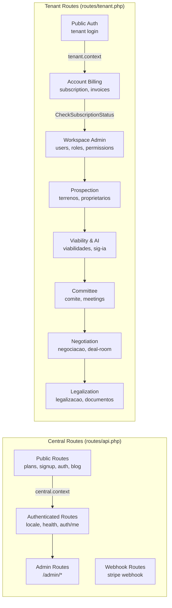
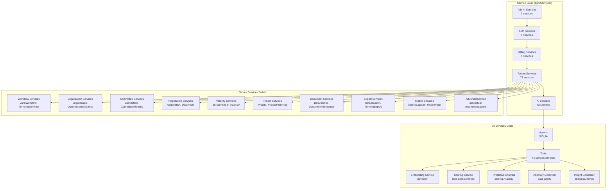
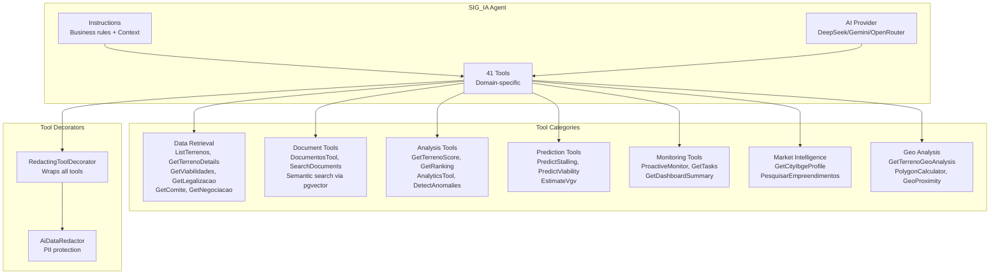
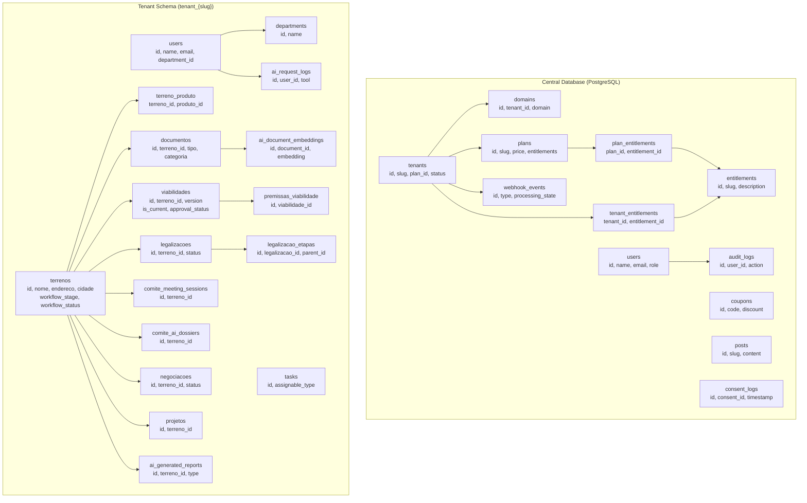
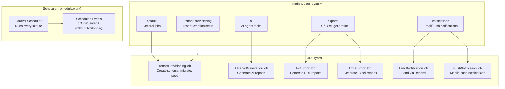
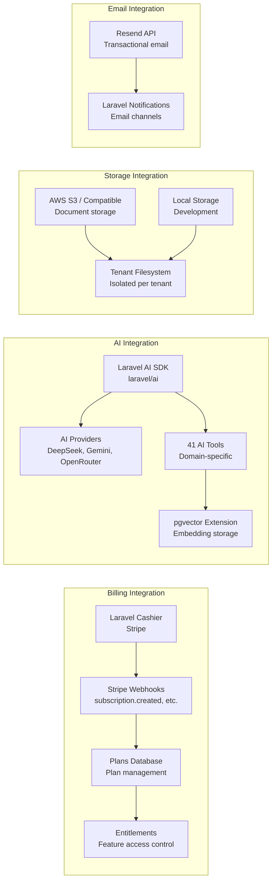
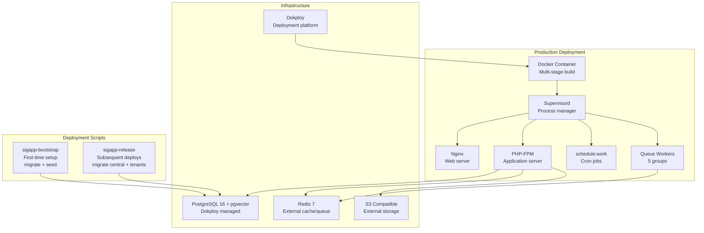

# SIGAPP Architecture Diagram

## Overview

SIGAPP is a multi-tenant SaaS platform for real estate management (land prospecting, economic viability, committee approval, negotiation, contracts, legalization, projects, and AI-powered analysis).

```mermaid
graph TB
    subgraph "Client Layer"
        FE[Next.js Frontend]
        MB[Mobile App]
    end
    
    subgraph "API Gateway"
        LB[Load Balancer]
        NGINX[Nginx Proxy]
    end
    
    subgraph "Central Application"
        CENTRAL_ROUTES[Central Routes<br/>api.php]
        CENTRAL_CONTROLLERS[Central Controllers<br/>Api/V1/]
        CENTRAL_MODELS[Central Models<br/>Models/Central/]
        CENTRAL_DB[(Central DB<br/>PostgreSQL)]
    end
    
    subgraph "Tenant Application"
        TENANT_ROUTES[Tenant Routes<br/>tenant.php]
        TENANT_CONTROLLERS[Tenant Controllers<br/>Api/V1/Tenant/]
        TENANT_MODELS[Tenant Models<br/>Models/Tenant/]
        TENANT_DB[(Tenant Schema<br/>PostgreSQL)]
    end
    
    subgraph "Shared Services"
        AI_AGENT[SIG_IA Agent<br/>41 Tools]
        QUEUE[Redis Queues<br/>5 Worker Groups]
        STORAGE[S3 Storage]
        CACHE[Redis Cache]
    end
    
    subgraph "External Services"
        STRIPE[Stripe Billing]
        EMAIL[Resend Email]
        AI_PROVIDERS[DeepSeek/Gemini/OpenRouter]
    end
    
    FE -->|HTTPS| LB
    MB -->|HTTPS| LB
    LB --> NGINX
    NGINX -->|Subdomain| CENTRAL_ROUTES
    NGINX -->|{tenant}.sigapp.com.br| TENANT_ROUTES
    
    CENTRAL_ROUTES --> CENTRAL_CONTROLLERS
    CENTRAL_CONTROLLERS --> CENTRAL_MODELS
    CENTRAL_MODELS --> CENTRAL_DB
    
    TENANT_ROUTES --> TENANT_CONTROLLERS
    TENANT_CONTROLLERS --> TENANT_MODELS
    TENANT_MODELS --> TENANT_DB
    
    CENTRAL_CONTROLLERS --> AI_AGENT
    TENANT_CONTROLLERS --> AI_AGENT
    
    CENTRAL_CONTROLLERS --> QUEUE
    TENANT_CONTROLLERS --> QUEUE
    
    CENTRAL_CONTROLLERS --> STORAGE
    TENANT_CONTROLLERS --> STORAGE
    
    CENTRAL_CONTROLLERS --> CACHE
    TENANT_CONTROLLERS --> CACHE
    
    CENTRAL_CONTROLLERS --> STRIPE
    CENTRAL_CONTROLLERS --> EMAIL
    AI_AGENT --> AI_PROVIDERS
```

## Multi-Tenancy Architecture

```mermaid
graph TB
    subgraph "Request Flow"
        REQ[Incoming Request]
        MIDDLEWARE[Middleware Stack]
        IDENTIFICATION[Tenant Identification]
        BOOTSTRAP[Tenancy Bootstrap]
    end
    
    subgraph "Identification Methods"
        SUBDOMAIN[Subdomain<br/>{tenant}.sigapp.com.br]
        HEADER[X-Tenant Header<br/>API/Mobile fallback]
        PATH[Path Parameter<br/>/tenant/{slug}]
    end
    
    subgraph "Bootstrappers"
        DB_BOOTSTRAP[Database Tenancy<br/>PostgreSQL Schema]
        CACHE_BOOTSTRAP[Cache Tenancy<br/>Redis Prefix]
        FS_BOOTSTRAP[Filesystem Tenancy<br/>Storage Path]
        QUEUE_BOOTSTRAP[Queue Tenancy<br/>Job Context]
    end
    
    subgraph "Database Structure"
        CENTRAL[(Central DB<br/>tenants, domains, plans, users)]
        TENANT1[(Tenant Schema 1<br/>tenant_{slug1})]
        TENANT2[(Tenant Schema 2<br/>tenant_{slug2})]
        TENANT3[(Tenant Schema N<br/>tenant_{slugN})]
    end
    
    REQ --> MIDDLEWARE
    MIDDLEWARE --> IDENTIFICATION
    IDENTIFICATION --> SUBDOMAIN
    IDENTIFICATION --> HEADER
    IDENTIFICATION --> PATH
    IDENTIFICATION --> BOOTSTRAP
    BOOTSTRAP --> DB_BOOTSTRAP
    BOOTSTRAP --> CACHE_BOOTSTRAP
    BOOTSTRAP --> FS_BOOTSTRAP
    BOOTSTRAP --> QUEUE_BOOTSTRAP
    DB_BOOTSTRAP --> CENTRAL
    DB_BOOTSTRAP --> TENANT1
    DB_BOOTSTRAP --> TENANT2
    DB_BOOTSTRAP --> TENANT3
```

## Route Organization



## Service Layer Architecture



## AI Agent (SIG_IA) Architecture



## Database Schema Organization



## Queue System Architecture



## Key Integrations



## Security & Authorization

```mermaid
graph TB
    subgraph "Authentication"
        SANCTUM[Laravel Sanctum<br/>Token-based auth]
        CENTRAL_AUTH[Central Auth<br/>Platform admins]
        TENANT_AUTH[Tenant Auth<br/>Tenant users]
        BROKER[Login Broker<br/>Cross-tenant login]
    end
    
    subgraph "Authorization (RBAC)"
        PERMISSIONS[Spatie Permissions<br/>roles, permissions]
        TEMPLATES[Plan Templates<br/>Role-per-plan matrix]
        ENTITLEMENTS[Entitlements<br/>Feature-based access]
        POLICIES[Policies<br/>Model-level authorization]
    end
    
    subgraph "Middleware Stack"
        FORCE_JSON[ForceJsonResponse<br/>JSON responses only]
        CENTRAL_CTX[EnsureCentralContext<br/>Central routes only]
        TENANT_CTX[EnsureTenantContext<br/>Tenant routes only]
        AUTH_CENTRAL[auth.central<br/>Central user guard]
        AUTH_TENANT[auth.tenant<br/>Tenant user guard]
        CENTRAL_ADMIN[central.admin<br/>Admin role required]
        CHECK_SUB[CheckSubscriptionStatus<br/>Active subscription required]
        ENFORCE_HOST[EnforceHostAccess<br/>Domain validation]
    end
    
    SANCTUM --> CENTRAL_AUTH
    SANCTUM --> TENANT_AUTH
    CENTRAL_AUTH --> BROKER
    PERMISSIONS --> TEMPLATES
    TEMPLATES --> ENTITLEMENTS
    ENTITLEMENTS --> POLICIES
    FORCE_JSON --> CENTRAL_CTX
    FORCE_JSON --> TENANT_CTX
    CENTRAL_CTX --> AUTH_CENTRAL
    AUTH_CENTRAL --> CENTRAL_ADMIN
    TENANT_CTX --> AUTH_TENANT
    AUTH_TENANT --> CHECK_SUB
    CENTRAL_CTX --> ENFORCE_HOST
    TENANT_CTX --> ENFORCE_HOST
```



## Deployment Architecture



## Technology Stack Summary

| Layer | Technology | Purpose |
|-------|-----------|---------|
| **Framework** | Laravel 13 | PHP framework |
| **Language** | PHP 8.4+ | Application language |
| **Database** | PostgreSQL 16 + pgvector | Central + tenant schemas |
| **Multi-tenancy** | stancl/tenancy 3.8 | Schema-based isolation |
| **Authentication** | Laravel Sanctum | Token-based auth |
| **Authorization** | spatie/laravel-permission 7.0 | RBAC |
| **Billing** | Laravel Cashier 16.0 | Stripe integration |
| **AI** | laravel/ai 0.10 | AI agent framework |
| **AI Providers** | DeepSeek, Gemini, OpenRouter | LLM providers |
| **Vector DB** | pgvector | Embedding storage |
| **Cache** | Redis 7 | Caching & queues |
| **Storage** | S3 / Local | File storage |
| **Email** | Resend | Transactional email |
| **PDF** | spatie/laravel-pdf + Browsershot | PDF generation |
| **Excel** | maatwebsite/excel 3.1 | Excel exports |
| **API Docs** | dedoc/scramble | OpenAPI documentation |
| **Testing** | PHPUnit 13 | Test framework |
| **Static Analysis** | PHPStan level 8 | Code quality |
| **Formatting** | Laravel Pint | Code formatting |
| **Frontend** | Next.js (separate repo) | Client application |
| **Deployment** | Docker + Dokploy | Container orchestration |
| **Process Manager** | Supervisord | Multi-process management |
